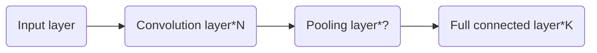

# Machine Learning in a Nutshell

*Start writting from Mar 4, 2018*

*A brief introduction to ML for physicists*

* toc
{:toc}
## Basic Concepts in Math and Machine Learning

### General Settings

Everytime we are faced with a dataset, how can we deal with it. So called data is just a group of number and we can arrange each data as a vector (for each component of the vector, we call it a feature), with or without labels. Labels in general is another vector (usually only one component) associate with data vectors. Now we have two different views on the whole dataset. We can  stack all of the data vectors in rows and make the whole dataset as a matrix. Or we can treat the data vector as a random variable whose distribution is specified by the whole dataset implicitly. Therefore, we can play with dataset in the context of **linear algebra** or **statistical inference**. And we can further gain more insights if we note the intrinsic connections between the two fields in math.

This note is about the algorithm, principles and philosopy of machine learning. For implementations and general idea in programming, ~~I may write a separate note in the future~~.

### Linear Algebra

* SVD (sigular value decomposition)

  For $$m\times n$$ matrix $$M$$ in field $$K$$, there exists a factorization, called a singular value decomposition of $$M$$, of the form
  $$
  \mathbf {M} =\mathbf {U} {\boldsymbol {\Sigma }}\mathbf {V} ^{\dagger},
  $$
  where $$U,V$$ is dimension $$m\times m, n\times n$$ unitary matrix in field $$K$$. The diagonal term of $$\Sigma$$ are single values. For singular vectors and construction of transformation matrix, see [here](https://en.wikipedia.org/wiki/Singular-value_decomposition#Singular_values,_singular_vectors,_and_their_relation_to_the_SVD).

  Truncated SVD, use only $$r\times r$$ matrix as $$\Sigma$$ to dramatically reduce the freedom representing the large matrix. For an application of truncated SVD in LSI (latent semantic indexing), see [this post](http://www.cnblogs.com/LeftNotEasy/archive/2011/01/19/svd-and-applications.html).

* Rayleigh quotient
  For a given Hermitian matrix M and nonzero vector x, the Rayleigh quotient is defined as:

  $$R(M,x)=\frac{x^\dagger M x}{x^\dagger x}$$.

  Such a value reaches the minimum value of the smallest eigenvalue of the matrix $$M$$, when the vector $$x$$ is the corresponding eigenvector. And the similar scenario applies to the max value of the quotient. One can easily project the vector x into the eigenvector basis to prove this. This quotient is nothing but energy functinal in quantum physics.

### Statistical Inference

* Covariance

  Covariance is defined for random variable

  $$\operatorname {cov} (X,Y)=\operatorname {E} {{\big [}(X-\operatorname {E} [X])(Y-\operatorname {E} [Y]){\big ]}}.$$

  For a random variable vector, its covariance matrix is defined as 

  $${\displaystyle \Sigma (\mathbf {X} )=\operatorname {cov} (\mathbf {X} ,\mathbf {X} ).}$$

  Suppose X is a random vector and A is a fixed transform vector, then we have:

  $${\displaystyle \Sigma (\mathbf {A} \mathbf {X} )=\operatorname {E} [\mathbf {A} \mathbf {X} \mathbf {X} ^{\mathrm {T} }\mathbf {A} ^{\mathrm {T} }]-\operatorname {E} [\mathbf {A} \mathbf {X} ]\operatorname {E} [\mathbf {X} ^{\mathrm {T} }\mathbf {A} ^{\mathrm {T} }]=\mathbf {A} \Sigma (\mathbf {X} )\mathbf {A} ^{\mathrm {T} }.}$$

* Multivariate Gaussian distribution

  A random variable vector follows

  $${\displaystyle \mathbf {X} \ \sim \ {\mathcal {N}}({\boldsymbol {\mu }},\,{\boldsymbol {\Sigma }}),}$$

  where $$\mathrm{\mu}$$ is the average vector and $$\mathrm{\Sigma}$$ is the covariance matrix. The density function is of the form

  $${\displaystyle {\begin{aligned}f_{\mathbf {X} }(x_{1},\ldots ,x_{k})&={\frac {\exp \left(-{\frac {1}{2}}({\mathbf {x} }-{\boldsymbol {\mu }})^{\mathrm {T} }{\boldsymbol {\Sigma }}^{-1}({\mathbf {x} }-{\boldsymbol {\mu }})\right)}{\sqrt {(2\pi )^{k}|{\boldsymbol {\Sigma }}|}}}\end{aligned}}}.$$

  The most useful feature of multivariate Gaussian distribution is the [conditional distributions](https://en.wikipedia.org/wiki/Multivariate_normal_distribution#Conditional_distributions), the final result of condition distribution $$(\mathbf{x_1}\vert \mathbf{x_2}=\mathbf{a})\sim N(\bar{\mu},\bar{\Sigma})$$ is 

  $$\bar{\mathbf{\mu}} = \mathbf{\mu_1} + \Sigma_{12} \Sigma_{22}^{-1}\left(\mathbf{a} -\mathbf{\mu_2}\right)$$ 

  and

  $${\displaystyle {\overline {\boldsymbol {\Sigma }}}={\boldsymbol {\Sigma }}_{11}-{\boldsymbol {\Sigma }}_{12}{\boldsymbol {\Sigma }}_{22}^{-1}{\boldsymbol {\Sigma }}_{21}.}$$

* KL divergence (Kullback–Leibler divergence)

  Defined as $${\displaystyle D_{\mathrm {KL} }(P\|Q)=-\sum _{i}P(i)\,\log {\frac {Q(i)}{P(i)}}}$$, where $$P,Q$$ are two random variables and easily to be extended to the continuum version. Note this is not a symmtrical definition! This quantity chracterizes the 'difference' of the two distributions. It is positive definite and be zero iff $$P,Q$$ are the same distributions. 

  KL divergence of two Gaussian distributions is 

  $${\displaystyle D_{\text{KL}}({\mathcal {N}}_{0}\|{\mathcal {N}}_{1})={1 \over 2}\left\{\operatorname {tr} \left({\boldsymbol {\Sigma }}_{1}^{-1}{\boldsymbol {\Sigma }}_{0}\right)+\left({\boldsymbol {\mu }}_{1}-{\boldsymbol {\mu }}_{0}\right)^{\rm {T}}{\boldsymbol {\Sigma }}_{1}^{-1}({\boldsymbol {\mu }}_{1}-{\boldsymbol {\mu }}_{0})-k+\ln {|{\boldsymbol {\Sigma }}_{1}| \over |{\boldsymbol {\Sigma }}_{0}|}\right\}.}$$

* Information entropy

  For discrete random variable $$X$$, the entropy $$H$$ is defined as $$H(X)=E(-\ln (P(X))=-\sum_{x_i}P(x_i)\ln P(x_i)$$. 

  We can also define conditional entropy as

  $${\displaystyle \mathrm {H} (X|Y)=E_X(H(Y\vert X=x))=\sum_x p(X=x)H(Y|X=x)=-\sum _{i,j}p(x_{i},y_{j})\log {\frac {p(x_{i},y_{j})}{p(y_{j})}}}.$$

  And the joint entropy:

  $$H(X,Y)=-\sum _{{x}}\sum _{{y}}P(x,y)\ln[P(x,y)].$$

  The joint entropy is greater than any individual entropy while no greater than the sum of them.

  Also there is concepts of information gain which measure the difference of information entropy $$IG(T,a)=H(T)-H(T\vert a)$$.

* Mutual information

  $${\displaystyle I(X;Y)=\sum _{y\in Y}\sum _{x\in X}p(x,y)\log {\left({\frac {p(x,y)}{p(x)\,p(y)}}\right)}},$$

  where $$X,Y$$ are two random variables. It is non-negative.

  Relations to conditional entropy:

  $${\displaystyle {\begin{aligned}I(X;Y)&{}\equiv \mathrm {H} (X)-\mathrm {H} (X|Y)\\&{}\equiv \mathrm {H} (Y)-\mathrm {H} (Y|X)\\&{}\equiv \mathrm {H} (X)+\mathrm {H} (Y)-\mathrm {H} (X,Y)\\&{}\equiv \mathrm {H} (X,Y)-\mathrm {H} (X|Y)-\mathrm {H} (Y|X)\end{aligned}}}$$

  Relation to KL divergence:

  $${\displaystyle \begin{aligned}I(X;Y)=&D(p(x,y)\vert\vert p(x)p(y))\\=& E_Y[D(p(x\vert y)\vert\vert p(x)))]\end{aligned}}$$

* Whitening transformation

  Make a linear transformation on the random variable vector so that the covariance matrix become the identity matrix (Of course such a definition can be generalized to the matrix case by the analogy in general setting section). Such transformation is not unique. The common approach to do that is PCA whitening. 

* Additive smoothing
  In statistics, additive smoothing, also called Laplace smoothing or Lidstone smoothing, is a technique used to smooth estimate probability of categorical data. Given an observation x = (x1, …, xd) N trials, a "smoothed" version of the data gives the probability estimator:
  $${\hat {\theta }}_{i}={\frac {x_{i}+\alpha }{N+\alpha d}}\qquad (i=1,\ldots ,d),$$

  where $$\alpha$$ is a small number called pseudocount. The original version of such formula comes from the [rule of succession](https://en.wikipedia.org/wiki/Rule_of_succession) ($$\alpha=1$$) which is designed to solve the [sunrise problem](https://en.wikipedia.org/wiki/Sunrise_problem). If you are confused with the prior ignorance and noninformative prior distributions, see [this doc](http://www.stats.org.uk/priors/noninformative/Smith.pdf) ,[the cheatsheet](http://www.stats.org.uk/priors/noninformative/YangBerger1998.pdf) or [my blog](https://refraction-ray.github.io/%E8%B4%9D%E5%8F%B6%E6%96%AF%E6%8E%A8%E6%96%AD%E5%B0%8F%E8%AE%AE/).

* MLE vs. MAP

  Frequentist vs. Bayesian: whether we have some nontrivial prior knowledge of this world and if the parameter $$\theta$$ a fixed value or random variable. Maximum likelihood estimation ($$P_\theta(X)$$) is equivalent to minmize the negative log likelihood. Maximum a posterior $$P(\theta|X)$$, has taken the prior $$P(\theta)$$ into consideration. The two approach are point estimation compared to full Bayes analysis, where the posterior distribution is calculated. You may refer [this article](https://zhuanlan.zhihu.com/p/32480810).

### Jargon in ML

* Linear classfier

  Classfier is a blackbox to determine the label for the data.  The blackbox of linear classfier is the innerproduct between data vector and some weight vectors: $$f(\vec{\omega}\cdot \vec{x}+\vec{b})$$. And by adopt the kernel trick, all approaches for representing linear classfier can be converted into nonlinear algorithms (eg. PCA, SVM). It can be understood as the simple form of NN, too. Similarly, we can also define **quadratic classfier**.

* Outliner

  Anomaly. Data that fall far away its group or maybe wrong labeled.

* Batch size

  The number of data vectors for an update on parameters in NN. If batch size is one, we call it online learning. If batch size is more than 1, we call it batch learning.

* Perceptron

  It is for the "node" or "neuron" in NN. And sometimes, it specifically stands for single neuron NN with step function as activation functions which can be served as a binary classfier similar with logistic regression.

* Evaluation method

  * Holdout

    Divided the data into traning set and evaluation set from the beginning

  * Cross Validation

    Devide data into k group. Use k-1 group to fit the model and use the left one to evaluate. Repeat the process k times.

  Be careful of the three different phases of training, evaluation and test. They must come from different data. Training is used to adjust parameters in the learning model automatically, evaluation is used to adjust the hyperparamters in the learning model by hand and test is used for final benchmark. Never use your test data before you are confident with your model. Test process is not used for you to tune model. Otherwise, the model makes no sense.

* Bias vs. variance

  Bias: predict value vs. real value (could be understood as the accuracy for training data).

  Variance: different prediction value in different realizations of model (in some sense the accuracy for validation data).

  The tradeoff: the more complicated the fitting model is, the smaller bias and the larger variance it becomes (over-fitting). See [this](http://scott.fortmann-roe.com/docs/BiasVariance.html) on the comparison and thoughts on these two terms. 

* Exploitation vs. exploration

  Here is a cool [explanation](https://medium.com/@dennybritz/exploration-vs-exploitation-f46af4cf62fe). Exploitation: learn one thing better (try to figure out what is the exactly average value). Exploration: learn something more (try to reduce the variance around). Scuh trade-off is common in recommendation system.

* Ensemble learning

  Definition: Train lots of similar model from sampling of the data, and let them vote for the right predictions. 

  For example, the so-called **bagging** method is to smaple the data with replacement for N times to make N fitting models for voting. Random forest is a typical application of bagging. 

  And if for the prediction, we don't use vote (the mode of predictions), instead train another model (usually logistic regression) with input as the output of the set of models and the output final prediction, such structure of ensemble learning is called **stacking**.

  And if we train weak learners stage-wisely, this is **boosting**. There are various ways to improve weak learners step by step, for example, [gradient boosting](https://en.wikipedia.org/wiki/Gradient_boosting), and especially GBDT (gradient boosting decision tree). GBDT is only useful for regression trees where gradient is meaningful. The prediction made by the GBDT is the sum of all predictions from the series of weak learners. Each tree is generate to bridge the gap between the real value and prediction from the sum of all trees before. See [this post](https://www.zybuluo.com/yxd/note/611571) for a detailed explanation.

  Another famous type of boosting method is [Adaboost](https://en.wikipedia.org/wiki/AdaBoost). This method assign a larger weight on the mislabeled data in the last round to train a new weak learner. At the same time, we give each weaker learner a weight for the final vote according to its accuracy. See [this post](http://www.csuldw.com/2016/08/28/2016-08-28-adaboost-algorithm-theory/) for more info.

  Different types of boosting approach can be explained in the same framework of addition model with forward stagewise algorithm, the differences come from the different choice of the loss function.

* Generative vs. Discriminative model

  Naively, one can agure that generative model are designed for create task, like image generation; while discriminative model is designed for recognition task, like image recongnition. Such understanding is too simple to be correct.

  Suppose the data is $$x$$ and the label is $$y$$. Discriminative model learns $$P(y\vert x)$$ directly to make a predict on the label of newcoming data. Moreover, discriminative model can learn a hard boundary of categories rather than probability. Instead, generative model learns the join distribution $$P(x,y)$$ and use Bayes inference to make prediction (generative model can still work in classfication questions!). What is the advantage for learning the joint distribution? Instead of predicting $$P(y \vert x)$$, you can use it to generate data from $$P(x \vert y)$$. For more comparison on these two concepts, see [this question](https://stats.stackexchange.com/questions/12421/generative-vs-discriminative) and [this blog post](http://freemind.pluskid.org/machine-learning/discriminative-modeling-vs-generative-modeling/).

* Supervised vs. Unsupervised learning

  Denpend on whether the data has labels. If there are labels for part of data, we call it SSL (semi-supervised learning). Actually, various conventinal supervised learning model can also be used in unsupervised learning scenario as long as one can come up with some clever ideas and designs.

  For example, so called confusion shceme is widely applied in physics study to determine the phase boundary (critical value). At the beginning, phase boundary location is in the supervised filed, training data should be with phase label. However, we can use different fake phase boundary to train the model and find the true boundary by require the maximum accuracy.

* Gradient descent

  Basically, one search for the extremum position of the function $$f(x)$$ using the iterative process

  $$x_{new}=x_{old}-\eta \nabla f(x).$$

  In machine learning, the function f is the loss function of the model. We try to search the minimum of the loss function utilizing such gradient descent method. Generally speaking, the loss function is the sum or expectation value across all data samples. It is time consuming if we update the paramters based on the original version of gradient descent. Therefore, everytime we only calculate a small fraction of the data, and derive the loss function. This is so called SGD(Stochastic Gradient Descent) approach.

## NNN (Non-Neural-Network) approaches

### k-Means clustering

The aim is to partition N data vectors into k-groups. The aim function is the sum of intra group variance:
$$
{\displaystyle {\underset {\mathbf {S} }{\operatorname {arg\,min} }}\sum _{i=1}^{k}\sum _{\mathbf {x} \in S_{i}}\left\|\mathbf {x} -{\boldsymbol {\mu }}_{i}\right\|^{2}={\underset {\mathbf {S} }{\operatorname {arg\,min} }}\sum _{i=1}^{k}|S_{i}|\operatorname {Var} S_{i}}.
$$
This is an NP hard problem. There is an [algorithm](https://en.wikipedia.org/wiki/K-means_clustering#Algorithms) utilizing the iterative process to do the classfication, but no guarantee for optimal solution. The basic procedure of the algorithm is assign each point a label according to the distance and update the cluster center.

 The initial center of clusters can be chosed based on so called [k-means++ algorithm](https://www.cnblogs.com/yixuan-xu/p/6272208.html).

### KNN (K-Nearest Neighbor)

KNN is supervised algorithm. The aim is to give the label of new input data based on original input data. The principle is to find the k neighbors of labeled data, and determine the label of the new one. For comparison between KNN and k-means, see [this post](http://blog.csdn.net/chlele0105/article/details/12997391).

### Mean Shift

Algorithm to locate the most dense part of dataset in the feature space. The basic idea is quite straightforward. Just find some point in feature space and then calcualte the weight center within some sphere centered by the start point. Then, iteratively move to the new center and repeat the calculation. Until we come to some fixed point and this is the most dense part in the space.

### Spectral Clustering

Define a graph with no self-edges. The wieght of edge is a measure of similarity. Therefore, we have the weight matrix of such graph. The goal is to divided the graph into pieces without cutting too much edges. A typical goal is called sparsity:

$$goal=\frac{Cut(G_1,G_2)}{Mass(G_1)Mass(G_2)},$$ 

where $$Mass()$$ is defined as the function for number of vertices. The denominator penalizes the imbalance cuts. We define the cut as indicator vector $$y\in R^n$$ (n is the number of vortice in graph G): 
$$
y_i=\left\{
\begin{aligned}
1 & ~~~ i\in G_1 \\
-1 &  ~~~i\in G_2 \\
\end{aligned}
\right.
$$

One can show the $$Cut(G_1,G_2)$$ function can be expressed as 

$$Cut=\frac{1}{4}y^TLy,$$

where $$L$$ is defined as the Laplacian matrix for G

$$L_{ij}=\left\{\begin{aligned}  -w_{ij},~~~ i\neq j \\  \sum_{k\neq i} w_{ik},~~~i=j\end{aligned}  \right.$$

The problem is NP hard unless we relax the restiction on vector $$y$$ to $$y^Ty=const$$. By doing this we can construct our optimal aim as Rayleigh ration of matrix $$L$$. Since the samllest eigenvalue is 0 for $$y=(1,1,…1)$$, the meaningful solution is the eigenvector of the second smallest eigenvalue (vertical to the first eigenvector means that the graph cut is an equally bisect), which is denoted as Fiedler vector. After we get the Fiedler vector, we use certain algorithm to make such vector mapping to $$\{0,1\}^n$$. (Usually choose a critical value leading min-sparsity for the mapping.)

Alternatively one can get the first $$k$$ eigenvectors $$y_i$$, and transpose these vectors to carry out k-means clustering to find the cut.

For more details and derivations, see [this lecture](https://people.eecs.berkeley.edu/~jrs/189/lec/22.pdf). 

### Naive Bayes Classifier

Just a simple application of Bayes inference: $$P(A\vert B)=\frac{P(B\vert A)P(A)}{P(B)}$$. Naive means that each feature B is statistical independet on each other. And AODE classfier is Bayes classifier without the naive indepedent assumptions. The famous formular can also be summarized as

$$posterior =\frac{likelyhood\times prior}{marginal}.$$

Empirical Bayes vs. full Bayes: the former estimates the prior from data while the latter using some fixed distribution for prior from the beginning. See different inference schemes in [this post](http://blog.csdn.net/lin360580306/article/details/51289543). Using Bayes inference, you can derive the distribution of the posterior which contains more info than simply MAP estimation.

### LDA (Linear Discriminant Analysis)

Alias: *Fisher's linear discriminant*. (Especially for two classes problem)

LDA is supervised learning whose aim is to find the optimal linear classifier for labeled high dimension data.  

Suppose we have set of data vector labeled in k classes. Mean value and covariance matrix is $$\mu_i$$ and $$\Sigma_i$$ respectively. Then the variance intra-class are $$\sum_{i=1}^k \vec{\omega}^T \Sigma_i \vec{\omega}$$. The variance inter-classes are $$\vec{\omega}^T \Sigma_b\vec{\omega}$$, where $$\Sigma _{b}={\frac {1}{C}}\sum _{i=1}^{C}(\mu _{i}-\mu )(\mu _{i}-\mu )^{T}$$. We use the ratio between variance inter and intra classes as the effectiveness of the classfication. To maximize this ratio, by utilizing the Larangian factor, we have the conclusion for LDA transform vector $$\omega$$ (the eigenvalue $$\lambda$$ correspoding to the ratio $$S=\frac{\sum_{i=1}^k \vec{\omega}^T \Sigma_i \vec{\omega}}{\vec{\omega}^T \Sigma_b\vec{\omega}}$$):
$$
\lambda (\sum_{i=1}^k\Sigma_i )\omega= \Sigma_b \omega .
$$

It is worth noting that LDA is actually a generatibe model instead of discirminative one. LDA assume the likelihood as Gaussian distribution with different mean vector but the same variance, and we can then max the posterior probability to get the coefficients. Such approach based on Bayes inference can be generalized as Gaussian discriminant analysis. See [this tutorial](https://people.eecs.berkeley.edu/~jrs/189/lec/07.pdf) for details on GDA and Q(uadratic)DA. And if we use GDA framework to calculate the posterior probability, we are about to get the logistic functions. 

### PCA (Principle Components Analysis)

PCA is similar with LDA, but data are without label. Therefore, PCA is unsupervised learning. At the begining, there is only one group of data. The aim of us is to use some project transform vector $$\omega$$ and make the variance largest after the projection. The calculation is similar with LDA case, and the final eigen solution is 
$$
\Sigma(X)\vec{\omega}=\lambda \vec{\omega}.
$$
Again, the larger the $$\lambda$$, the more effective of the dimension reduction axis.

Note that $$X^TX$$ itself can be recognised as proportional to the empirical sample covariance matrix of the dataset **X** (which is the dataset with zero empirical mean each column). The structure of data set matrix X: each of the rows represents a different repetition of the experiment, and each of the columns gives a particular kind of feature.

Or just get the principal values and vectors via SVD. $$\lambda$$ as eigenvalues for covariance matrix of $$X$$ is actually eqivalent to the squre of SVD value for $$X$$. In other words, SVD and PCA are the same thing (see the [explanation](https://math.stackexchange.com/questions/3869/what-is-the-intuitive-relationship-between-svd-and-pca/3871#3871) if you are confused with the equivalence).

### Kernel PCA

Map original data point $$x$$ to $$\phi(x)$$ in higher dimension, we only need to define the kernel function of inner product  $$\phi^T(x)\phi(y)=K(x,y)$$ for further calculation. See the [slides](http://www.cs.haifa.ac.il/~rita/uml_course/lectures/KPCA.pdf) or [blog](https://zhanxw.com/blog/2011/02/kernel-pca-%E5%8E%9F%E7%90%86%E5%92%8C%E6%BC%94%E7%A4%BA/) for details. In this way, by choosing appropriate kernel functions, PCA can handle non-linear knowledge in the data. 

### ICA (Independent Component Analysis)

For comparision between ICA and PCA, see [this answer](https://www.zhihu.com/question/28845451). The idea is somewhat similar to PCA. The difference is the critiria for basis choice: maximize the standard deviation or nonGaussianity.

### NMF (Non-negative Matrix Factorization)

It somewhat is similar to the ideas for truncated SVD but with only two matrix with non-negative elements. The factorization is not unique and there are many [iterative alogrithm](https://en.wikipedia.org/wiki/Non-negative_matrix_factorization#Algorithms) to find such factor matrix.

### CCA (Canonical Correlation Analysis)

The way to find the two linear combination of two random variable vector respectively to maxmize the covariance of the two inner products (the most correlation direction). See [wiki](https://en.wikipedia.org/wiki/Canonical_correlation) for derivation details or [blog](http://www.cnblogs.com/jerrylead/archive/2011/06/20/2085491.html) for example applications and kernel extensions.

### SVM (Support Vector Machine)

Basically, it is to find an optimal hyperplane to seperate data, which is also one type of linear classfier with supervised learning. The aim of the separation is based on the evaluation of distance to the hyperplane from nearest data point, specifically we need to minimize $${\displaystyle \|{\vec {w}}\|} $$ subject to $${\displaystyle y_{i}({\vec {w}}\cdot {\vec {x}}_{i}-b)\geq 1,} $$ for $$ {\displaystyle i=1,\,\ldots ,\,n} $$, where $$y_i$$ is the label $$\pm1$$ of the data $$x_i$$.
The application of SVM require the data can be linearly separated. If not, either kernel trick or soft margin target can be applied.
See integrated [blog](http://blog.csdn.net/v_july_v/article/details/7624837) for more info on SVM (kernel trick and the formula derivation of optimal problem are included). For the difference between LDA and SVM, see [this question](https://stats.stackexchange.com/questions/243932/what-is-the-difference-between-svm-and-lda).

### Decision Trees

Decison trees is just a tree with nodes as the features condition while final leaves as the classfication. It is supervised.  Classification tree predicts discrete classes while regression tree predicts real numbers. CART is the short for classification and regression trees.

To generate such a tree with least nodes and smallest path, usually we generate nodes from top to bottom, and keep some index the extrem value through the constructing of the node. Namely, from the top, we pick the features of the node based on some value evaluation dependent on features. Such value evaluation includes information gain , gini coefficient gain and variance reduction in continuum case (ie. regression trees).  For information gain, I have give the formula before. For gini coefficient, the value is defined as $$gini(X)=1-\sum_{X=x_i}p(x_i)^2$$. 

For basic introduction on decision trees algorithm, see [here](https://www.ibm.com/developerworks/cn/analytics/library/ba-1507-decisiontree-algorithm/index.html). For the difference between different algorithms in decision trees (ID3, C4.5, CART), see [here](https://www.zhihu.com/question/27205203). The main difference is the index (information gain or its ratio or gini coefficients) and whether they can deal with continuum features (namely regression trees).

To avoid overfitting which is common in decision tree generation, we need some algorithms on pre-pruning and post-pruning.  Besides, early stopping and return posterior probablity instead of categories in leaves might also be helful.

### Random Forest

Lots of trees (bagging method) make the forest. To generate each tree, we need data samples from all the data (dataset N and features M). We sample with replacement N times of data and with $$m<<M$$ features for each tree. No pruning process is needed for the forest. Use the mode of all the trees as the final prediction. Typically, the number of trees is of size 100 to 1000. One can use cross validation to find the optimal number of trees. It is interesting that instead of the mode, the variation of predictions amonst trees is also of meaning.

### Regression

* Regression analysis

  The conventional fit scheme for output as continuous variable, eg. linear regression. The loss function is the ordinary least square. 

  $$L_0=\sum_i(\hat{y_i}^2-y_i^2).$$

  To avoid overfitting and to get a more stable solution for fitting paramters $$\theta$$,  we introduce the below methods.

  * Ridge regression

    Add $$L_2$$ regularization term into the loss function. Only responsible for shrinking the value of fitting parameters. 

    $$L_2 = \sum_i \theta_i^2.$$

  * Lasso regression

    Add $$L_1$$ regularization term into the loss function.  Tend to reduce the number of freedom of parameters.

    $$L_1= \sum_i \vert \theta_i \vert.$$

  Of course, we have to tune hyperparamter $$\lambda$$ before regularization term to optimize the trade off between bias and variance.

* Logistic regression

  The fit scheme for output as two seperate values (0,1). So called logistic function: $$\sigma (t)={\frac {e^{t}}{e^{t}+1}}={\frac {1}{1+e^{-t}}}$$. Fit the data with $$\sigma(ax+b)$$. Unlike linear regression, there is no formular for $$a,b$$ dependent on the data provided. We should find the optimal paramters by iterations to optimal the aim which can be viewed as the error or the likelyhood from different aspects. And actually, such regression can be viewed as a two layer NN with sigmoid activation function and one output. 

  Why the function $$\sigma$$ is used to estimated the probability binary distribution? Try locate the boundary of the two classes via 

  $$\ln (\frac{P(true)}{P(false)})=\frac{\sigma(t)}{1-\sigma(t)}=ax+b=0.$$

  We are back to the linear class boundary and this is consitent with LDA derivation.

### Gaussian process 

Gaussian process is the Gaussian distribution on infinite number of random variables (variables in continuum limit), and once several variables are picked up, they follow the multivariate Gaussian distribution.

Suppose you now have data $$(x_1,…x_n)$$ and $$(y_1,…y_n)$$, now you are given $$x_{n+1}$$, and be asked what is the most possible value of $$y_{n+1}$$. To make such a prediction, we usually first assume some form of the function $$y=f(x)$$, and use the given data to do a regression to fit the parameters of $$f$$. And finally, the prediction is $$\hat{y}_{n+1}=f(x_{n+1})$$. 

The basic idea of GPR (Gaussian Process for Regression) is instead assuming all the $$y$$ follow Gaussian process and hence $$(y_1,…y_{n+1})$$ follow Gaussian distributions. If we further assume some function form of the covariance matrix (kernel functions) for this Gaussian distribution (the mean vector is usually zero by assumption), we can utilize the condition distribution of multivariate Gaussian distribution to predict $$P(y_n+1\vert (y_1,…y_n))$$. 

For tutorial on Gaussian process and its usage on regression and even more on classification and dimension reduction (GP-LVM), I strongly recommend [this doc](https://www.robots.ox.ac.uk/~mebden/reports/GPtutorial.pdf).

## NN (neural network) family

### Feed Forward Neural Network

* Why we need neural network?

Suppose we need to fit more complicated mapping with lots of parameters than cases in NNN approach, what is the efficient way to do this? This problem can be divided into two parts: structures of paramters to represent some map and efficient way to optimize these paramters. You may be able to name various approaches for how parameters can be organized to represent arbitrary mappings, however the second requirement restricts our imagination to very limit case. The one frequently used in CS field is so called neural networks. (Maybe tensor network in physics field is another possibility.)

* Structure of parameters

Take the simplest full connected FFNN as an example, see fig below.

The neurons are orginized as layers, and all the line arrows represent matrix multiplication. One can set as many hidden layers as he likes, though it may hard to train. From one layer to the next layer, we have

$$f(\mathbf{w}\mathbf{x}+\mathbf{b}),$$

where x is the vector with length the same as the first layer (say n), b is the bias vector with the length the same as the second layer (say m), w is the matrix with size $$m\times n$$ and f is called activate function which apply on the vector elementwise, i.e. $$f(\mathbf{x})_i=f(x_i)$$. As long as you stack all layers together and do the calculation between every neighborhood layers as mentioned above, we are arriving at the basic NN.

The frequently used activation function includes sigmoid, tanh and RELU(Rectified Linear Unit). The only requirement of activation function is differentiable and non-linear. (suitable for back propagation and make multilayers meaningful)

|sigmoid|tanh| RELU|softmax|
|:-:|:-:|:-:|:--:|
|$$\frac{1}{1+e^{-x}}$$|$$\tanh (x)$$|$$max(0,x)$$|$$\frac{e^{x_i}}{\sum_j e^{x_j}}$$|

* How to train

Now we have done the algorithom of prediction part of neural network. Namely, when an input data is given to the NN, how can the model give the output vector(prediction). But the remaining problem is how to decide the parameters of the model, namely matrix w (weight in arrows) and bias vector b (bias in neurons). The answer is the training algorithm of the NN. 

We use the philosophy of SGD to train and update all parameters in the model. The algorithm is so called back propagation. It is just SGD of the loss function. Loss function is the aim we want to optimize for the model. See table below for frquently used loss functions, I omit the sum of output neuron and the sum over data for simplicity. We call it propagation due to the fact that we need the help from chain rules of derivatives to carry out gradient descent and that's it. For detailed derivation and implementation on the basic back propagation approach, see this [note](https://www.zybuluo.com/hanbingtao/note/476663). On training process, we train the model n epochs and in each epoch, we update parameters after each batch of data. Typical value for epochs is $$10^2$$ and for batch is $$10^1$$.

|cross entropy|square loss| exponential loss | 0-1 loss |
|:-:|:-:|:-:|:--:|
|$$y_i\ln \hat{y_i}$$|$$(\hat{y_i}-y_i)^2$$|$$exp(-y_i\hat{y_i})$$|$$Boolean(\hat{y_i}-y_i)$$|

But there are still some thing cannot be trained. For example, the number of layers, size of training batch and number of epochs, activation function for each layer and loss function. We call such things hyper paramter, they cannot simply determined by training but need to be fixed manually.

* Three stage of training model

A general workflow to train a NN model is divided in three stages. The data must be divided into three part accordingly, i.e. training data, evaluation data and test data. 

Traning data is for usual back propagation training process and parameters updates. Evaluation data is used in evaluation process, where the accuracy is calculated though the evaluation data is not used to update parameters. What is the use of evaluation? It aims to guide the hyperparamters update. We can change our settings of the NN (hyperparameters) to make the accuracy in evaluation process higher. And for test data, it is the final examination of the model. If the accuracy is acceptable, then the model is ready to go. You are NEVER allowed to adjust your model (no matter parameters or hyper parameters) based on the test data. Testing is merely a final examination, it is CHEATING if you train the model with any hints from the test process.  And it is also WRONG to evaluate your final model based on the evaluation data, since you have adjusted the model to satisfy them before (Frankly speaking, physicists usually get things wrong related to this paragraph, what they have done are mostly circular argument and make nonsense).

Once we have the training algorithm and the prediction algorithm, we can fit every function in the world as long as we have enough paramters. (But if the number of parameters increases with the system size, the model is impossible to make sense in computers.)

* Summary on the components of NN

Layers, connections, activation functions in each layer, loss functions.

### Convolutional Neural Network

CNN is designed for image recongnition with special connection structures and suitable for systems with input data in higher dimension. Since the size of input data of images is very large, we are about to have too much paramters in the NN if insisting on full connected NN. Therefore, CNN utilize local connectivity and weight sharing to sole the above issue on full connected NN. Part of the images of this and the following section come from [this note](https://www.zybuluo.com/hanbingtao/note/485480).

The general layer structure of CNN: 

The structure of convolution and pooling layer together can repeat for M times. The example CNN looks like the figure below.

Here, $$N=1,M=2,K=2$$. 

* Convolution layer

For image pixels, we label them as $$x_{ij}$$. To extract the feature maps from convolution, we use the formula

$$a_{ij}=f(\sum_{m=0}^2\sum_{n=0}^2 w_{mn}x_{i+m,j+n}+w_b).$$

See the fig below to get a more clear idea. In this case, the window move one pixel each time, the stride is one.

The depth of the freture map (number of feature maps) equals the number of filters we used in this layer, the size of feature maps is related with stride and the size of original images.) See the figure below for a more complicated case, where we have some zero padding in the edge of images which is very helpful for recongnization of the edge feature of the image.

* Pooling layer

By pooling layer, we further extract and compress info from the feature maps to reduce parameters and complexity of the model. For example, max pooling is the approach to extract the maximum value of each separate window from feture map. See figure below.

The principle of training and predicting of the model and the rest part of the model is similar with FFNN (actually the derivation of back propagation in this case is a bit involved).

The most famous construction of CNN is LeNet-5, see figure below.

* Graph CNN (GCN)

Graph is one type of organization of big data, information is stored in the edges and nodes. In some sense one can develop CNN to distinguish graphs instead of images, which would extend the application of CNN broadly.  It is still a very new and active field, see [this post](https://tkipf.github.io/graph-convolutional-networks/) for a quick intro on GCN.

### Recurrent Neural Network

* general idea

RNN is designed for NLP (natural language processing) related tasks. A sentence may contain different number of words, but all the NN model we construct before only take fixed length input. To resolve this issue, we come to the construction of RNN. The basic structure is shown in the figure below.

Each circle is a NN itself (all circles are the same NN in the sense that they share the same parameters), $$x_i$$ is  part of the input (the word or character) or all the $$x$$ can be viewed as the input (the sentence) and $$o_i$$ is the output (say prediction of next word) or the last $$o_{t=last}$$ can be viewed as single output (for sentence classfication). What makes the circle different for each input is the hidden states $$s_i$$ instead of the paramters. The forward prediction formula is 

$$o_t=g(Vs_t);~~~~s_t=f(U x_t+W s_{t-1}).$$

So the output $$o_t$$ is dependent on all the previous $$x_t$$ implicitly. And the state of neuron $$s_t$$ is kept for the next input $$x_{t+1}$$.

If the circle is a deep NN, one can set hidden variables in neurons in each layer.

* Bi-directional RNN

Just two separate RNN, with different time direction, the two networks don't share the weight paramters. And the outpust is just the sum of the two output from the two RNN. Bi-directional RNN is designed for word completion in the middle of the sentence instead of predicting the next word.

The training algorithm for RNN is so called BPTT (backpropagation through time) which shares the same philosophy as back propagation. See detailed derivation [here](https://zybuluo.com/hanbingtao/note/541458).

RNN is very deep NN in the time direction, so it is faced with serious gradient exposion or gradient vanishing problem. For gradient explosion, you are going to meet NAN in the training and it is easier to handle (set the cutoff). However it is more subtle to deal with gradient vanishing problem. It is difficult to find the problem at the first place. To solve this problem, one tend to use RELU activation function or use the LSTM model, the substitute for the traditional RNN with similar structure.

* Input and output structures

By manipulating the structure of RNN and utilizing different perspectives on input and output, we can construct RNN type networks for different tasks.

1. text auto generation (one to many)

   Just treat each $$o_i$$ as the prediction of the next word and also use $$x_{t+1}=o_{t}$$ as the input of the next time. Therefore, by simply assign one word, we can generate the whole paragraph. To see how effectiveness of such text generation, see [this fantastic post](http://karpathy.github.io/2015/05/21/rnn-effectiveness/) for some interesting examples.

2. video frame classification or prediction (many(N) to many(N))

   Still vanilla RNN structure, but treat each $$o_t$$ as the label of input frame $$x_t$$.

3. sentence classification (many to one)

   Say we want to classify the sentiment of one sentence, whether it is happy or angry. We use all $$x_t$$ as the input words from the sentence and use the final $$o_{last}$$ as the classification output.

4. seq2seq for translation (many(N) to many(M))

   

   The input x is in one language and the output y is in the other language. The same meaning isn't necessary to have the same length of word in different languages. The final output of the input series  RNN (encoder) will be transported to the output RNN series (decoder). For more on seq2seq, see [this](https://chunml.github.io/ChunML.github.io/project/Sequence-To-Sequence/).

   We can further introduce attention mechanism in seq2seq model. The rough idea is the input of decoder is not only the final output of encoder but also all original inputs through some transformation. The example structure is shown below. The context vector calculated from the input series together with the output of decoder give the final output (with an activation function). See [this post](https://medium.com/@Synced/a-brief-overview-of-attention-mechanism-13c578ba9129) for details and see [this review](http://www.cnblogs.com/robert-dlut/p/5952032.html) for more variants on attention mechanism in RNN.

   

   ​	

* LSTM (long short term memory networks)

* GRU (Gated recurrent units) and Other variants

### Autoencoder

* Vanilla AE
* Denoising AE (DAE)
* Sparse AE (SAE)
* Variational autoencoder (VAE)
* CVAE (Conditional VAE)

### Boltzmann Machine

* Hopfield network
* Boltzmann machine
* Restricted Boltzmann machine (RBM)
* Deep belief network (DBN)

### More Generative Networks

* Generative adversarial networks (GAN)
* Nomalizing flows

## Advanced ML approaches

### Active Learning

Components of active learning $$(C,L,S,Q,U)$$: C is the classifier trained for labeled data L, U is unlabeled data and Q is the query algorithm to pick most uninformative unlabeled data. Such data should be labeled by "expert" S then. Firstly, one have some data in L. Then one can train a C based on L. Then we use Q strategy to pick some data from U and label them via S. Next, retraining the model C based on new enlarged L. Repeat these steps until the C classifier is satisfying. 

The core of such algorithm is the strategy of Q. One can query by uncertainty, by expected change, by error reduction, by trade-off between exploration and exploitation and so on. Therefore, active learning is a framework with algorithm and implementation dependent on specific problems. 

### Semisupervised Learning

Pure semisupervised learning: unlabeled data for training is not the data for predicting. 

Transductive learning: unlabeled data is both for training and predicting.

There are various algorithm developed for semisupervised learning.

### Reinforce Learning

##Applications in Physics

*Mainly from talks of March Meeting 2018 in LA*

### As wavefunctions

### As classifiers or calculators

### As recommendation systems

* SLMC (self-learning Mote Carlo)
* Active learning on phase diagram searching

### As other tools

### Physics help ML

* TNS

## Main Reference
### Series or books

* Some blog sites in Chinese: [blog](http://www.cnblogs.com/LeftNotEasy/), [blog](http://blog.csdn.net/v_july_v), [blog](http://www.cnblogs.com/robert-dlut/), [blog](http://bealin.github.io/), [blog](https://jlunevermore.github.io/)
* Some blog sites in English: [blog](https://chunml.github.io/), [blog](http://www.wildml.com/), [blog](http://karpathy.github.io/), [blog](https://machinelearningmastery.com), [blog](http://colah.github.io/)

* Lei Wang's lecture notes: [link](http://wangleiphy.github.io/lectures/DL.pdf)
* Andrew Moore's slides: [link](https://www.autonlab.org/tutorials)
* Lectures of Universities: [Berkeley](https://people.eecs.berkeley.edu/~jrs/189/), [Stanford](http://cs229.stanford.edu/)
* Other reference series: [gitbook](https://wizardforcel.gitbooks.io/dm-algo-top10), [notes on NN](https://www.zybuluo.com/hanbingtao/note/476663)

### Papers or blogs

See corresponding references in the main text. 

