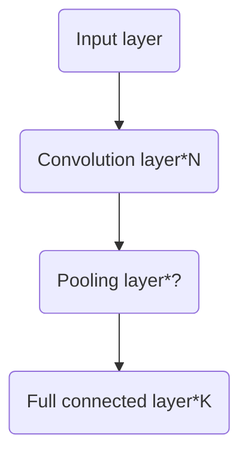

# Machine Learning in a Nutshell

*Start writting from Mar 4, 2018*

*A brief introduction to ML for physicists*

* toc
{:toc}
## Basic Concepts in Math and Machine Learning

### Overview and History

This note is about the algorithm, principles and philosopy of machine learning. For implementations and general ideas in programming, ~~I may write a separate note in the future~~. It is  just a roadmap to ML, the details are lack, hence it is more like a dictionary than a tutorial. The aim of this note is to make the readers have a general idea about ML approaches. If you are going to learn more, see links and references in the note and get your hands dirty: writting code and playing with the math.

See the following posters to have a rough idea on tribes and history of ML.

See this [wiki](https://en.wikipedia.org/wiki/Timeline_of_machine_learning) for timeline of machine learning. See [this post](http://www.erogol.com/brief-history-machine-learning/) and the figure below for the trend and milestones of ML in history.  

The two main communities in ML field:

> - 「I do not come to AI to do statistics.」
   - 「I do not have interest in AI.」

### General Settings

Everytime we are faced with a dataset, how can we deal with it. So called data is just a group of number and we can arrange each data as a vector (for each component of the vector, we call it a feature), with or without labels. Labels in general is another vector (usually only one component) associate with data vectors. Now we have two different views on the whole dataset. We can  stack all of the data vectors in rows and make the whole dataset as a matrix. Or we can treat the data vector as a random variable whose distribution is specified by the whole dataset implicitly. Therefore, we can play with dataset in the context of **linear algebra** or **statistical inference**. And we can further gain more insights if we note the intrinsic connections between the two fields in math.

### Linear Algebra

* SVD (sigular value decomposition)

  For $$m\times n$$ matrix $$M$$ in field $$K$$, there exists a factorization, called a singular value decomposition of $$M$$, of the form
  $$
  \mathbf {M} =\mathbf {U} {\boldsymbol {\Sigma }}\mathbf {V} ^{\dagger},
  $$
  where $$U,V$$ is dimension $$m\times m, n\times n$$ unitary matrix in field $$K$$. The diagonal term of $$\Sigma$$ are single values. For singular vectors and construction of transformation matrix, see [here](https://en.wikipedia.org/wiki/Singular-value_decomposition#Singular_values,_singular_vectors,_and_their_relation_to_the_SVD).

  **Truncated SVD**, use only $$r\times r$$ matrix as $$\Sigma$$ to dramatically reduce the freedom representing the large matrix. For an application of truncated SVD in LSI (latent semantic indexing), see [this post](http://www.cnblogs.com/LeftNotEasy/archive/2011/01/19/svd-and-applications.html).

* Rayleigh quotient
  For a given Hermitian matrix M and nonzero vector x, the Rayleigh quotient is defined as:
  $$
  R(M,x)=\frac{x^\dagger M x}{x^\dagger x}.
  $$
  Such a value reaches the minimum value of the smallest eigenvalue of the matrix $$M$$, when the vector $$x$$ is the corresponding eigenvector. And the similar scenario applies to the max value of the quotient. One can easily project the vector x into the eigenvector basis to prove this. This quotient is nothing but energy functional in quantum physics.

* Curse of dimensionality

  Data in very high dimension has many weird behavior comapred to 3D we are familiar with. Data points in higher dimension are sparse: the number of data points is exponential increasing with the dimension if you keep the density of data. Novel features in high dimension also include: the Euclidean distance betwenn all pairs of points are nearly the same; the volume of hypersphere with radius r is approaching zero compared to the cube with edge 2r. Therefore, many familiar approaches to manipulate and organize data don't work well in very high dimension.

### Statistical Inference

* Covariance

  Covariance is defined for random variable

  $$\operatorname {cov} (X,Y)=\operatorname {E} {{\big [}(X-\operatorname {E} [X])(Y-\operatorname {E} [Y]){\big ]}}.$$

  For a random variable vector, its covariance matrix is defined as 

  $${\displaystyle \Sigma (\mathbf {X} )=\operatorname {cov} (\mathbf {X} ,\mathbf {X} ).}$$

  Suppose X is a random vector and A is a fixed transform vector, then we have the frequently used relation:

  $${\displaystyle \Sigma (\mathbf {A} \mathbf {X} )=\operatorname {E} [\mathbf {A} \mathbf {X} \mathbf {X} ^{\mathrm {T} }\mathbf {A} ^{\mathrm {T} }]-\operatorname {E} [\mathbf {A} \mathbf {X} ]\operatorname {E} [\mathbf {X} ^{\mathrm {T} }\mathbf {A} ^{\mathrm {T} }]=\mathbf {A} \Sigma (\mathbf {X} )\mathbf {A} ^{\mathrm {T} }.}$$

* Multivariate Gaussian distribution

  A random variable vector follows

  $${\displaystyle \mathbf {X} \ \sim \ {\mathcal {N}}({\boldsymbol {\mu }},\,{\boldsymbol {\Sigma }}),}$$

  where $$\mathrm{\mu}$$ is the average vector and $$\mathrm{\Sigma}$$ is the covariance matrix. The density function is of the form

  $${\displaystyle {\begin{aligned}f_{\mathbf {X} }(x_{1},\ldots ,x_{k})&={\frac {\exp \left(-{\frac {1}{2}}({\mathbf {x} }-{\boldsymbol {\mu }})^{\mathrm {T} }{\boldsymbol {\Sigma }}^{-1}({\mathbf {x} }-{\boldsymbol {\mu }})\right)}{\sqrt {(2\pi )^{k}|{\boldsymbol {\Sigma }}|}}}\end{aligned}}}.$$

  The most useful feature of multivariate Gaussian distribution is the [conditional distributions](https://en.wikipedia.org/wiki/Multivariate_normal_distribution#Conditional_distributions), the final result of condition distribution $$(\mathbf{x_1}\vert \mathbf{x_2}=\mathbf{a})\sim N(\bar{\mu},\bar{\Sigma})$$ is 

  $$\bar{\mathbf{\mu}} = \mathbf{\mu_1} + \Sigma_{12} \Sigma_{22}^{-1}\left(\mathbf{a} -\mathbf{\mu_2}\right)$$ 

  and

  $${\displaystyle {\overline {\boldsymbol {\Sigma }}}={\boldsymbol {\Sigma }}_{11}-{\boldsymbol {\Sigma }}_{12}{\boldsymbol {\Sigma }}_{22}^{-1}{\boldsymbol {\Sigma }}_{21}.}$$

* KL divergence (Kullback–Leibler divergence)

  Defined as $${\displaystyle D_{\mathrm {KL} }(P\|Q)=-\sum _{i}P(i)\,\log {\frac {Q(i)}{P(i)}}}$$, where $$P,Q$$ are two random variables and easily to be extended to the continuum version. Note this is not a symmtrical definition! This quantity characterizes the 'difference' of the two distributions. It is positive definite and be zero iff $$P,Q$$ are the same distributions. 

  KL divergence of two Gaussian distributions is 

  $${\displaystyle D_{\text{KL}}({\mathcal {N}}_{0}\|{\mathcal {N}}_{1})={1 \over 2}\left\{\operatorname {tr} \left({\boldsymbol {\Sigma }}_{1}^{-1}{\boldsymbol {\Sigma }}_{0}\right)+\left({\boldsymbol {\mu }}_{1}-{\boldsymbol {\mu }}_{0}\right)^{\rm {T}}{\boldsymbol {\Sigma }}_{1}^{-1}({\boldsymbol {\mu }}_{1}-{\boldsymbol {\mu }}_{0})-k+\ln {|{\boldsymbol {\Sigma }}_{1}| \over |{\boldsymbol {\Sigma }}_{0}|}\right\}.}$$

* Information entropy

  For discrete random variable $$X$$, the entropy $$H$$ is defined as $$H(X)=E(-\ln (P(X))=-\sum_{x_i}P(x_i)\ln P(x_i)$$. 

  We can also define **conditional entropy** as

  $${\displaystyle \mathrm {H} (X|Y)=E_X(H(Y\vert X=x))=\sum_x p(X=x)H(Y|X=x)=-\sum _{i,j}p(x_{i},y_{j})\log {\frac {p(x_{i},y_{j})}{p(y_{j})}}}.$$

  And the joint entropy:

  $$H(X,Y)=-\sum _{{x}}\sum _{{y}}P(x,y)\ln[P(x,y)].$$

  The joint entropy is greater than any individual entropy while no greater than the sum of them.

  Also there is concepts of **information gain** which measure the difference of information entropy $$IG(T,a)=H(T)-H(T\vert a)$$.

* Mutual information

  $${\displaystyle I(X;Y)=\sum _{y\in Y}\sum _{x\in X}p(x,y)\log {\left({\frac {p(x,y)}{p(x)\,p(y)}}\right)}},$$

  where $$X,Y$$ are two random variables. It is non-negative.

  Relations to conditional entropy:

  $${\displaystyle {\begin{aligned}I(X;Y)&{}\equiv \mathrm {H} (X)-\mathrm {H} (X|Y)\\&{}\equiv \mathrm {H} (Y)-\mathrm {H} (Y|X)\\&{}\equiv \mathrm {H} (X)+\mathrm {H} (Y)-\mathrm {H} (X,Y)\\&{}\equiv \mathrm {H} (X,Y)-\mathrm {H} (X|Y)-\mathrm {H} (Y|X)\end{aligned}}}$$

  Relation to KL divergence:

  $${\displaystyle \begin{aligned}I(X;Y)=&D(p(x,y)\vert\vert p(x)p(y))\\=& E_Y[D(p(x\vert y)\vert\vert p(x)))]\end{aligned}}$$

* Perplexity

  Perplexity of discrete distribution is defined as $$2^{H(p)}$$.  A low perplexity indicates the probability distribution is good at predicting the sample

* Whitening transformation

  Make a linear transformation on the random variable vector so that the covariance matrix become the identity matrix (Of course such a definition can be generalized to the matrix case by the analogy in general setting section). Such transformation is not unique. The common approach to do that is PCA whitening. 

* Additive smoothing
  In statistics, additive smoothing, also called Laplace smoothing or Lidstone smoothing, is a technique used to smooth estimate probability of categorical data. Given an observation x = (x1, …, xd) N trials, a "smoothed" version of the data gives the probability estimator:
  $$
  {\hat {\theta }}_{i}={\frac {x_{i}+\alpha }{N+\alpha d}}\qquad (i=1,\ldots ,d),
  $$
  where $$\alpha$$ is a small number called pseudocount. The original version of such formula comes from the [rule of succession](https://en.wikipedia.org/wiki/Rule_of_succession) ($$\alpha=1$$) which is designed to solve the [sunrise problem](https://en.wikipedia.org/wiki/Sunrise_problem). If you are confused with the prior ignorance and noninformative prior distributions, see [this doc](http://www.stats.org.uk/priors/noninformative/Smith.pdf) ,[the cheatsheet](http://www.stats.org.uk/priors/noninformative/YangBerger1998.pdf) or [my blog](https://refraction-ray.github.io/%E8%B4%9D%E5%8F%B6%E6%96%AF%E6%8E%A8%E6%96%AD%E5%B0%8F%E8%AE%AE/).

* MLE vs. MAP

  Frequentist vs. Bayesian: whether we have some nontrivial prior knowledge of this world and if the parameter $$\theta$$ a fixed value or random variable. Maximum likelihood estimation ($$P_\theta(X)$$) is equivalent to minmize the negative log likelihood. Maximum a posterior $$P(\theta|X)$$, has taken the prior $$P(\theta)$$ into consideration. The two approach are point estimation compared to full Bayes analysis, where the posterior distribution is calculated. You may refer [this article](https://zhuanlan.zhihu.com/p/32480810).

* EM (expectation maximization) algorithm

  EM is an iterative estimation of MLE when the data is incomplete or has missing (hidden) values. For the distribution parameter $$\theta$$ of data $$X$$, the final task (MLE) is
  $$
  \theta^* = \underset{\theta}{arg\, max} \;ln \sum_z P(X,z\vert \theta).
  $$
  The iterative process of EM includes two steps: E-step and M-step. In E-step, we maximize the likelihood with respect to the distribution of hidden variables and in M-step, we maximize it with respect to the parameter $$\theta$$. Specifically, in E step, we find the optimal distribution of latent variable z with fixed $$\theta$$, the update rule is
  $$
Q_n(z)=P(z\vert X,\theta_n).
  $$
  In M step, the update rule is 
  $$
  \theta_{n+1}=\underset{\theta}{arg\,max}E_{z\vert X,\theta_n} [\ln P(X,z\vert \theta)].
  $$
  See the derivation and application (**Mixtures of Gaussians**) of EM algorithm in [this doc](http://www.cmlab.csie.ntu.edu.tw/~cyy/learning/tutorials/EM.pdf). See [this paper](https://www.nature.com/articles/nbt1406.pdf)  or the figure below from this paper for a simple example.

  

### Jargon in ML

* Linear classfier

  Classfier is a blackbox to determine the label for the data.  The blackbox of linear classfier is the innerproduct between data vector and some weight vectors: $$f(\vec{\omega}\cdot \vec{x}+\vec{b})$$. And by adopt the kernel trick, all approaches for representing linear classfier can be converted into nonlinear algorithms (eg. PCA, SVM). It can be understood as the simple form of NN, too. Similarly, we can also define **quadratic classfier**.

* Outliner

  Anomaly. Data that fall far away its group or maybe wrong labeled.

* Batch size

  The number of data vectors for an update on parameters in NN. If batch size is one, we call it online learning. If batch size is more than 1, we call it batch learning.

* Perceptron

  It is for the "node" or "neuron" in NN. And sometimes, it specifically stands for single neuron NN with step function as activation functions which can be served as a binary classfier similar with logistic regression.

* Evaluation method

  * Holdout

    Divided the data into traning set and evaluation set from the beginning

  * Cross Validation

    Devide data into k group. Use k-1 group to fit the model and use the left one to evaluate. Repeat the process k times.

  Be careful of the three different phases of training, evaluation and test. They must come from different data. Training is used to adjust parameters in the learning model automatically, evaluation is used to adjust the hyperparamters in the learning model by hand and test is used for final benchmark. Never use your test data before you are confident with your model. Test process is not used for you to tune model. Otherwise, the model makes no sense.

* Bias vs. variance

  Bias: predict value vs. real value (could be understood as the accuracy for training data).

  Variance: different prediction value in different realizations of model (in some sense the accuracy for validation data).

  The tradeoff: the more complicated the fitting model is, the smaller bias and the larger variance it becomes (over-fitting). See [this](http://scott.fortmann-roe.com/docs/BiasVariance.html) on the comparison and thoughts on these two terms. 

* Exploitation vs. exploration

  Here is a cool [explanation](https://medium.com/@dennybritz/exploration-vs-exploitation-f46af4cf62fe). Exploitation: learn one thing better (try to figure out what is the exactly average value). Exploration: learn something more (try to reduce the variance around). Scuh trade-off is common in recommendation system. $$\epsilon$$- greedy is an algorithm to find the optimal position between exploitation and exploration.

* Prudent vs. greedy

  The trade-off betwenn interest in near and far future (locally vs global rewards). A prudent algorithm is always welcome. However, in most cases, prudent consideration lead to NP hard algorithms. Therefore, we have to take greedy algorithm in many cases and hope finding local optimal settings step by step is not too far away from the true global minimum or maximum. 

* Ensemble learning

  Definition: Train lots of similar model from sampling of the data, and let them vote for the right predictions. 

  For example, the so-called **bagging** method is to smaple the data with replacement for N times to make N fitting models for voting. Random forest is a typical application of bagging. 

  And if for the prediction, we don't use vote (the mode of predictions), instead train another model (usually logistic regression) with input as the output of the set of models and the output final prediction, such structure of ensemble learning is called **stacking**.

  And if we train weak learners stage-wisely, this is **boosting**. There are various ways to improve weak learners step by step, for example, [gradient boosting](https://en.wikipedia.org/wiki/Gradient_boosting), and especially GBDT (gradient boosting decision tree). GBDT is only useful for regression trees where gradient is meaningful. The prediction made by the GBDT is the sum of all predictions from the series of weak learners. Each tree is generate to bridge the gap between the real value and prediction from the sum of all trees before. See [this post](https://www.zybuluo.com/yxd/note/611571) for a detailed explanation.

  Another famous type of boosting method is [Adaboost](https://en.wikipedia.org/wiki/AdaBoost). This method assign a larger weight on the mislabeled data in the last round to train a new weak learner. At the same time, we give each weaker learner a weight for the final vote according to its accuracy. See [this post](http://www.csuldw.com/2016/08/28/2016-08-28-adaboost-algorithm-theory/) for more info.

  Different types of boosting approach can be explained in the same framework of **addition model** with forward stagewise algorithm, the differences come from the different choices of the loss function.

* Generative vs. Discriminative model

  Naively, one can agure that generative model are designed for create task, like image generation; while discriminative model is designed for recognition task, like image recongnition. Such understanding is too simple to be correct.

  Suppose the data is $$x$$ and the label is $$y$$. Discriminative model learns $$P(y\vert x)$$ directly to make a predict on the label of newcoming data. Moreover, discriminative model can learn a hard boundary of categories rather than probability. Instead, generative model learns the join distribution $$P(x,y)$$ and use Bayes inference to make prediction (generative model can still work in classfication questions!). What is the advantage for learning the joint distribution? Instead of predicting $$P(y \vert x)$$, you can use it to generate data from $$P(x \vert y)$$ by sampling. For more comparison on these two concepts, see [this question](https://stats.stackexchange.com/questions/12421/generative-vs-discriminative) and [this blog post](http://freemind.pluskid.org/machine-learning/discriminative-modeling-vs-generative-modeling/).

* Supervised vs. Unsupervised learning

  Denpend on whether the data has labels. If there are labels for part of data, we call it SSL (semi-supervised learning). Actually, various conventinal supervised learning model can also be used in unsupervised learning scenario as long as one can come up with some smart ideas and designs.

  For example, so called **confusion shceme** is widely applied in physics study to determine the phase boundary (critical value). At the beginning, phase boundary location is in the supervised filed, training data should be with phase label. However, we can use different fake phase boundary to train the model and find the true boundary by require the maximum accuracy.

  Besides, there are also approaches named after semi-supervised learning, there is a seperate section for this topic.

* Gradient descent

  Basically, one search for the extremum position of the function $$f(x)$$ using the iterative process

  $$
  x_{new}=x_{old}-\eta \nabla f(x).
  $$
  In machine learning, the function f is the loss function of the model. We try to search the minimum of the loss function utilizing such gradient descent method. Generally speaking, the loss function is the sum or expectation value across all data samples. It is time consuming if we update the paramters based on the original version of gradient descent. Therefore, everytime we only calculate a small fraction of the data, and derive the loss function. This is so called **SGD** (Stochastic Gradient Descent) approach. SGD is not only fast in implementation but also helpful avoiding local minimum.

  

  There are also various advanced optimizer to optimize loss function, such as **adam** (frequently used in NN training practice). For the improvements of all kinds of optimizers compared to SGD, see [this brief summary](https://zhuanlan.zhihu.com/p/22252270).

## NNN (Non-Neural-Network) approaches

### KNN (K-Nearest Neighbor)

KNN is supervised algorithm. The aim is to give the label of new input data based on original input data. The principle is to find the k neighbors of labeled data, and determine the label of the new one. For comparison between KNN and k-means, see [this post](http://blog.csdn.net/chlele0105/article/details/12997391).

### k-Means Clustering

The aim is to partition N data vectors into k-groups. The aim function is the sum of intra group variance:
$$
{\displaystyle {\underset {\mathbf {S} }{\operatorname {arg\,min} }}\sum _{i=1}^{k}\sum _{\mathbf {x} \in S_{i}}\left\|\mathbf {x} -{\boldsymbol {\mu }}_{i}\right\|^{2}={\underset {\mathbf {S} }{\operatorname {arg\,min} }}\sum _{i=1}^{k}|S_{i}|\operatorname {Var} S_{i}}.
$$
This is an NP hard problem. There is an [algorithm](https://en.wikipedia.org/wiki/K-means_clustering#Algorithms) utilizing the iterative process to do the classfication, but no guarantee for optimal solution. Specifically, the algorithm is the following: 

Assignment step: Assign each observation to the cluster whose mean has the least squared Euclidean distance, this is intuitively the "nearest" mean.

Update step: Calculate the new means to be the centroids of the observations in the new clusters.

The initial center of clusters can be chosed based on so called [k-means++ algorithm](https://www.cnblogs.com/yixuan-xu/p/6272208.html). The philosophy behind k-Means clustering is EM algorithm, see [this blog](http://www.cnblogs.com/jerrylead/archive/2011/04/06/2006910.html) for the analysis on this connection.

### Mean Shift

Algorithm to locate the most dense part of dataset in the feature space. The basic idea is quite straightforward. Just find some point in feature space and then calcualte the weight center within some sphere centered by the start point. Then, iteratively move to the new center and repeat the calculation. Until we come to some fixed point and this is the most dense part in the space.

### Spectral Clustering

Define a graph with no self-edges. The wieght of edge is a measure of similarity. Therefore, we have the weight matrix of such graph. The goal is to divided the graph into pieces without cutting too much edges. A typical goal is called sparsity:
$$
goal=\frac{Cut(G_1,G_2)}{Mass(G_1)Mass(G_2)},
$$
where $$Mass()$$ is defined as the function for number of vertices. The denominator penalizes the imbalance cuts. We define the cut as indicator vector $$y\in R^n$$ (n is the number of vortice in graph G): 
$$
y_i=\left\{
\begin{aligned}
1 & ~~~ i\in G_1 \\
-1 &  ~~~i\in G_2 \\
\end{aligned}
\right.
$$
One can show the $$Cut(G_1,G_2)$$ function can be expressed as 

$$
Cut=\frac{1}{4}y^TLy,
$$
where $$L$$ is defined as the **Laplacian matrix** for graph G
$$
L_{ij}=\left\{\begin{aligned}  -w_{ij},~~~ i\neq j \\  \sum_{k\neq i} w_{ik},~~~i=j\end{aligned}  \right.
$$
The problem is NP hard unless we relax the restiction on vector $$y$$ to $$y^Ty=const$$. By doing this we can construct our optimal aim as Rayleigh ration of matrix $$L$$. Since the samllest eigenvalue is 0 for $$y=(1,1,…1)$$, the meaningful solution is the eigenvector of the second smallest eigenvalue (orthogonal to the first eigenvector means that the graph cut is an equally bisect), which is denoted as **Fiedler vector**. After we get the Fiedler vector, we use certain algorithm to make such vector mapping to $$\{0,1\}^n$$. (Usually choose a critical value leading min-sparsity for the mapping.)

Alternatively one can get the first $$k$$ eigenvectors $$y_i$$, and transpose these vectors to carry out k-means clustering to find the cut.

For more details and derivations, see [this lecture](https://people.eecs.berkeley.edu/~jrs/189/lec/22.pdf). 

### Naive Bayes Classifier

Just a simple application of Bayes inference: $$P(A\vert B)=\frac{P(B\vert A)P(A)}{P(B)}$$. Naive means that each feature B is statistical independet on each other. And **AODE classfier** (averaged one-dependence estimators) is Bayes classifier without the naive indepedent assumptions. The famous formular can also be summarized as

$$
posterior =\frac{likelyhood\times prior}{marginal}.
$$
Empirical Bayes vs. full Bayes: the former estimates the prior from data while the latter using some fixed distribution for prior from the beginning. See different inference schemes in [this post](http://blog.csdn.net/lin360580306/article/details/51289543). Using Bayes inference, you can derive the distribution of the posterior which contains more info than simply MAP estimation.

### LDA (Linear Discriminant Analysis)

Alias: *Fisher's linear discriminant*. (Especially for two classes problem)

LDA is supervised learning whose aim is to find the optimal linear classifier for labeled high dimension data.  

Suppose we have set of data vector labeled in k classes. Mean value and covariance matrix is $$\mu_i$$ and $$\Sigma_i$$ respectively. Then the variance intra-class are $$\sum_{i=1}^k \vec{\omega}^T \Sigma_i \vec{\omega}$$. The variance inter-classes are $$\vec{\omega}^T \Sigma_b\vec{\omega}$$, where $$\Sigma _{b}={\frac {1}{C}}\sum _{i=1}^{C}(\mu _{i}-\mu )(\mu _{i}-\mu )^{T}$$. We use the ratio between variance inter and intra classes as the effectiveness of the classfication. To maximize this ratio, by utilizing the Larangian factor, we have the conclusion for LDA transform vector $$\omega$$ (the eigenvalue $$\lambda$$ correspoding to the ratio $$S=\frac{\vec{\omega}^T \Sigma_b\vec{\omega}}{\sum_{i=1}^k \vec{\omega}^T \Sigma_i \vec{\omega}}$$):
$$
\lambda (\sum_{i=1}^k\Sigma_i )\omega= \Sigma_b \omega .
$$
It is worth noting that LDA is actually a generative model instead of discirminative one. LDA assume the likelihood as Gaussian distribution with different mean vector but the same variance, and we can then max the posterior probability to get the coefficients. Such approach based on Bayes inference can be generalized as **Gaussian discriminant analysis**, where we assusme data of each class can be summarized as Gaussian distributions. And we use MAP as follows to determine the class of data.
$$
P(Y=C\vert X=x)\propto P(X=x\vert Y=C)\pi_C
$$
See [this tutorial](https://people.eecs.berkeley.edu/~jrs/189/lec/07.pdf) for details on GDA and Q(uadratic)DA. And if we use GDA framework to calculate the posterior probability, we are about to get the logistic functions. 

### PCA (Principle Components Analysis)

PCA is similar with LDA, but data are without label. Therefore, PCA is unsupervised learning. At the begining, there is only one group of data. The aim of us is to use some project transform vector $$\omega$$ and make the variance largest after the projection. The calculation is similar with LDA case, and the final eigen solution is 
$$
\Sigma(X)\vec{\omega}=\lambda \vec{\omega}.
$$
Again, the larger the $$\lambda$$, the more effective of the dimension reduction axis.

Note that $$XX^T$$ itself can be recognised as proportional to the empirical sample covariance matrix of the dataset **X** (which is the dataset with zero empirical mean each column). The structure of data set matrix X: each of the rows represents a different repetition of the experiment, and each of the columns gives a particular kind of feature.

Or just get the principal values and vectors via SVD. $$\lambda$$ as eigenvalues for covariance matrix of $$X$$ is actually equivalent to the squre of SVD value for $$X$$. In other words, SVD and PCA are the same thing (see the [explanation](https://math.stackexchange.com/questions/3869/what-is-the-intuitive-relationship-between-svd-and-pca/3871#3871) if you are confused with the equivalence).

### Kernel PCA

Map original data point $$x$$ to $$\phi(x)$$ in higher dimension, we only need to define the kernel function of inner product  $$\phi^T(x)\phi(y)=K(x,y)$$ for further calculation.  Because we are never working directly in the higher dimension feature space, the kernel-formulation of PCA is restricted in that it computes not the principal components themselves, but the projections of our data onto those components. Namely

$$\phi(x)_k=(\sum_{i=1}^N a_i^k \phi(x_i))^T\phi(x).$$

There are still some subtle issues left, see the [slides](http://www.cs.haifa.ac.il/~rita/uml_course/lectures/KPCA.pdf) or [blog](https://zhanxw.com/blog/2011/02/kernel-pca-%E5%8E%9F%E7%90%86%E5%92%8C%E6%BC%94%E7%A4%BA/) for details. In this way, by choosing appropriate kernel functions, PCA can handle non-linear knowledge and seperation in the data. Such **kernel trick** can be genralized to nearly all ML methods for linear classifier and make them more capable on dataset with non-linear nature.

### ICA (Independent Component Analysis)

For comparision between ICA and PCA, see [this answer](https://www.zhihu.com/question/28845451). The idea is somewhat similar to PCA. The difference is the critirion for basis choice: maximize the standard deviation or non-Gaussianity.

### NMF (Non-negative Matrix Factorization)

It somewhat is similar to the ideas for truncated SVD but with only two matrix with non-negative elements. The factorization is not unique and there are many [iterative alogrithm](https://en.wikipedia.org/wiki/Non-negative_matrix_factorization#Algorithms) to find such factor matrix.

### CCA (Canonical Correlation Analysis)

The way to find the two linear combination of two random variable vector respectively to maxmize the covariance of the two inner products (the most correlation direction). See [wiki](https://en.wikipedia.org/wiki/Canonical_correlation) for derivation details or [blog](http://www.cnblogs.com/jerrylead/archive/2011/06/20/2085491.html) for example applications and kernel extensions.

### SVM (Support Vector Machine)

Basically, it is to find an optimal hyperplane to seperate data, which is also one type of linear classfier with supervised learning. The aim of the separation is based on the evaluation of distance to the hyperplane from nearest data point, specifically we need to minimize $${\displaystyle \|{\vec {w}}\|} $$ subject to $${\displaystyle y_{i}({\vec {w}}\cdot {\vec {x}}_{i}-b)\geq 1,} $$ for $$ {\displaystyle i=1,\,\ldots ,\,n} $$, where $$y_i$$ is the label $$\pm1$$ of the data $$x_i$$.
The application of SVM require the data can be linearly separated. If not, either kernel trick or **soft margin target** can be applied.
See integrated [blog](http://blog.csdn.net/v_july_v/article/details/7624837) for more info on SVM (kernel trick and the formula derivation of optimal problem are included). For the difference between LDA and SVM, see [this question](https://stats.stackexchange.com/questions/243932/what-is-the-difference-between-svm-and-lda).

### Decision Trees

Decison trees is a tree with nodes as the features condition while final leaves as the classfication. It is supervised.  Classification tree predicts discrete classes while regression tree predicts real numbers. **CART** is the short for classification and regression trees.

To generate such a tree with least nodes and smallest path, usually we generate nodes from top to bottom, and keep some index the extrem value through the constructing of the node. Namely, from the top, we pick the features of the node based on some value evaluation dependent on features. Such value evaluation includes information gain , **gini coefficient gain** and variance reduction in continuum case (ie. regression trees).  For information gain, I have give the formula before. For gini coefficient, the value is defined as $$gini(X)=1-\sum_{X=x_i}p(x_i)^2$$. 

For basic introduction on decision trees algorithm, see [here](https://www.ibm.com/developerworks/cn/analytics/library/ba-1507-decisiontree-algorithm/index.html). For the difference between different algorithms in decision trees (**ID3**, **C4.5**, **CART**), see [here](https://www.zhihu.com/question/27205203). The main difference is the index (information gain or its ratio or gini coefficients) and whether they can deal with continuum features (namely regression trees).

To avoid overfitting which is common in decision tree generation, we need some algorithms on pre-pruning and post-pruning.  Besides, early stopping and return posterior probablity instead of categories in leaves might also be helful.

### Random Forest

Lots of trees (bagging method) make the forest. To generate each tree, we need data samples from all the data (dataset N and features M). We sample with replacement N times of data and with $$m<<M$$ features for each tree. No pruning process is needed for the forest. Use the mode of all the trees as the final prediction. Typically, the number of trees is of size 100 to 1000. One can use cross validation to find the optimal number of trees. It is interesting that instead of the mode, the variation of predictions amonst trees is also meaningful.

### Regression

* Regression analysis

  The conventional fit scheme for output as continuous variable, eg. linear regression. The loss function is the ordinary least square. 

  $$L_0=\sum_i(\hat{y_i}^2-y_i^2).$$

  To avoid overfitting and to get a more stable solution for fitting paramters $$\theta$$,  we introduce the below methods.

  * Ridge regression

    Add $$L_2$$ regularization term into the loss function. Only responsible for shrinking the value of fitting parameters. 

    $$L_2 = \sum_i \theta_i^2.$$

  * Lasso regression

    Add $$L_1$$ regularization term into the loss function.  Tend to reduce the number of freedom of parameters.

    $$L_1= \sum_i \vert \theta_i \vert.$$

  Of course, we have to tune hyperparamter $$\lambda$$ before regularization term $$L_{1,2}$$ to optimize the trade off between bias and variance.

* Logistic regression

  The fit scheme for output as two seperate values (0,1). So called logistic function: $$\sigma (t)={\frac {e^{t}}{e^{t}+1}}={\frac {1}{1+e^{-t}}}$$. Fit the data with $$\sigma(ax+b)$$. Unlike linear regression, there is no formular for $$a,b$$ dependent on the data provided. We should find the optimal paramters by iterations to optimal the aim which can be viewed as the error or the likelyhood from different aspects. And actually, such regression can be viewed as a two layer NN with sigmoid activation function and one output. 

  Why the function $$\sigma$$ is used to estimated the probability binary distribution? Try locate the boundary of the two classes via 

  $$\ln (\frac{P(true)}{P(false)})=\frac{\sigma(t)}{1-\sigma(t)}=ax+b=0.$$

  We are back to the linear class boundary and this is consitent with LDA derivation.

### Gaussian Process 

Gaussian process is the Gaussian distribution on infinite number of random variables (variables in continuum limit), and once several variables are picked up, they follow the multivariate Gaussian distribution.

Suppose you now have data $$(x_1,…x_n)$$ and $$(y_1,…y_n)$$, now you are given $$x_{n+1}$$, and be asked what is the most possible value of $$y_{n+1}$$. To make such a prediction, we usually first assume some form of the function $$y=f(x)$$, and use the given data to do a regression to fit the parameters of $$f$$. And finally, the prediction is $$\hat{y}_{n+1}=f(x_{n+1})$$. 

The basic idea of **GPR** (Gaussian Process for Regression) is instead assuming all the $$y$$ follow Gaussian process and hence $$(y_1,…y_{n+1})$$ follow Gaussian distributions. If we further assume some function form of the covariance matrix (kernel functions) for this Gaussian distribution (the mean vector is usually zero by assumption), we can utilize the condition distribution of multivariate Gaussian distribution to predict $$P(y_n+1\vert (y_1,…y_n))$$. 

For tutorial on Gaussian process and its usage on regression and even more on classification and dimension reduction (**GP-LVM**), I strongly recommend [this doc](https://www.robots.ox.ac.uk/~mebden/reports/GPtutorial.pdf).

### Manifold Learning

This family of approaches mainly focus on nonlinear dimension reduction. The belief is that data in higher dimension Euclidean space are actually lie in certain lower dimension manifolds within this space. Sometimes kernel PCA is though as manifold learning, too. The list of approaches in manifold learning is very long, see [this doc](http://scikit-learn.org/stable/modules/manifold.html). We only list several methods below. Note in practice manifold learning techniques are so finicky that they are rarely used for anything more than simple qualitative visualization of high-dimensional data. See [this section](https://jakevdp.github.io/PythonDataScienceHandbook/05.10-manifold-learning.html#Some-Thoughts-on-Manifold-Methods) for its drawbacks.

* Isomap

Use the distance matrix instead of position matrix for data. The distance is also not defined in Euclidean space but in abstract graphs. Using k-NN to link the edge of graph, and the distance is defined as the shortest distance (number of edges) between two nodes (data points). After we have the distance matrix of data, we use **MDS** (multidimension scaling) algorithm to carry out the dimension reduction (linear embedding). The philosophy of MDS is to project data into lower dimension and at the same time try to keep the distance between datapoints unchanged.

See [this post](http://blog.csdn.net/Dark_Scope/article/details/53229427) for more info on isomap and MDS and [this](http://blog.csdn.net/u010705209/article/details/53518772) on details of MDS.

* Locally Linear Embedding

The basic idea: only keep distances unchanged between nearby points intead of all points in MDS.

* t-SNE (t-distributed stochastic neighbor embedding)

See the algorithm [here](http://www.datakit.cn/blog/2015/08/06/t_SNE.html). The distance between data points is measured by some probability with Gaussian weight of Euclidean distance. Then we use KL divergence of such distance probability distribution for data in high and low dimension to train the projection. From original SNE to the improved t-SNE algorithm, see [here](http://qiancy.com/2016/11/12/sne-tsne/).

In summary, so called manifold learning is to grasp the distance between points in higher dimension. The Euclidean distance doesn't work well due to the curse of dimension, hence one have to find other local coordinates or something similar with the help of manifold conception. 

### Probability Graphical Models

See [this answer](https://www.zhihu.com/question/35866596/answer/236886066) for a general picture. This family of models are suitable for sequence manipulation in NLP.

* directed and undirected models

In undirected model, the node represents the random variable while the link between nodes represent some positive-definite potential function (in general some exponential function) depedent on these nodes (random variables). Therefore, undirected models give the joint probability distribution of all nodes by product of each link function. 

As for directed graphs, they are more like hierarchical probability model where each node represents a conditional probability, and the final probability is the product of all the nodes.

* HMM (Hidden Markov Model)

Markov chain with a latent variable. HMM is determined by the initial distribution of starting vector $$\pi$$, the transfer matrix A and the observation matrix B. 
$$
a_{ij}=P(i_{t+1}=q_j\vert i_t=q_i)~~~~b_{j}(k)=P(o_t=v_k\vert i_t =q_j)
$$
Three basic problems in HMM: 1. train to learn A B (MLE with hidden states or Baum-Welch without hidden states); 2. find the hidden states series with the most possibility(**Viterbi algorithm**, I recommend [this post](http://cpmarkchang.logdown.com/posts/192522-natural-language-processing-viterbi-algorithm)); 3. Compute the probability of given sequence.

* MEMM (Maximum-entropy Markov Model)

Its is discriminative model instead of generative model as HMM. It directly model the likelihood as 
$$
P(i_t\vert i_{t-1})=\frac{1}{Z(o_t,i_{t-1})}e^{\sum_a \lambda_a f_a(o_t,i_t)}.
$$
$$f$$ is functions we specify and the weight $$\lambda$$ are parameters we have to train using optimizer as any classfier.

There are three types of problems as in HMM, too.

* CRF (Conditinal random field)

CRF is also discriminative model, we refer to linear chain CRF specifically. The probability formula for such classfier is 
$$
P(I\vert O)=\frac{1}{Z(O)}e^{\sum_i^T\sum_k^M\lambda_k f_k(O,I_{i-1},I_i,i)}.
$$
 See an introduction by tagging example [here](http://blog.echen.me/2012/01/03/introduction-to-conditional-random-fields/).

To conclude the NNN approaches part, there are also various approaches closed to the ML field, like **genetic algorithm** (for its role in ML field, see [this discussion](https://www.reddit.com/r/MachineLearning/comments/3zv4fk/genetic_algorithms_in_machine_learning/)), **topic models** in NLP, etc. We won't cover those methods in this note for now.

  

## NN (neural network) family

### Feed Forward Neural Network

* Why we need neural network?

Suppose we need to fit more complicated mapping with lots of parameters than cases in NNN approach, what is the efficient way to do this? This problem can be divided into two parts: structures of paramters to represent some map and efficient way to optimize these paramters. You may be able to name various approaches for how parameters can be organized to represent arbitrary mappings, however the second requirement restricts our imagination to very limit case. The one frequently used in CS field is so called neural networks. (Maybe tensor network in physics field is another possibility.)

* Structure of parameters

Take the simplest full connected FFNN as an example, see fig below.

The neurons are orginized as layers, and all the line arrows represent matrix multiplication. One can set as many hidden layers as he likes, though it may hard to train. From one layer to the next layer, we have

$$f(\mathbf{w}\mathbf{x}+\mathbf{b}),$$

where x is the vector with length the same as the first layer (say n), b is the bias vector with the length the same as the second layer (say m), w is the matrix with size $$m\times n$$ and f is called **activation function** which apply on the vector elementwise, i.e. $$f(\mathbf{x})_i=f(x_i)$$. As long as you stack all layers together and do the calculation between every neighborhood layers as mentioned above, we are arriving at the basic NN.

The frequently used activation function includes **sigmoid**, tanh and **RELU**(Rectified Linear Unit). The only requirement of activation function is differentiable and non-linear. (suitable for back propagation and make multilayers meaningful)

|sigmoid|tanh| RELU|leaky RELU|softmax|
|:-:|:-:|:-:|:--:|:--:|
|$$\frac{1}{1+e^{-x}}$$|$$\tanh (x)$$|$$max(0,x)$$|$${\displaystyle f(x)={\begin{cases}x&{\mbox{if }}x>0\\\lambda x&{\mbox{if }}x\leq 0\end{cases}}}$$|$$\frac{e^{x_i}}{\sum_j e^{x_j}}$$|

* How to train

Now we have done the algorithom of prediction part of neural network. Namely, when an input data is given to the NN, how can the model give the output vector(prediction). But the remaining problem is how to decide the parameters of the model, namely matrix w (weight in arrows) and bias vector b (bias in neurons). The answer is the training algorithm of the NN. 

We use the philosophy of SGD to train and update all parameters in the model. The algorithm is so called **back propagation**. It is just SGD of the loss function. Loss function is the aim we want to optimize for the model. See table below for frquently used loss functions, I omit the sum of output neuron and the sum over data for simplicity. We call it propagation due to the fact that we need the help from chain rules of derivatives to carry out gradient descent and that's it. For detailed derivation and implementation on the basic back propagation approach, see this [note](https://www.zybuluo.com/hanbingtao/note/476663). On training process, we train the model n epochs and in each epoch, we update parameters after each batch of data. Typical value for epochs is $$10^2$$ and for batch is $$10^1$$.

|cross entropy|square loss| exponential loss | 0-1 loss |
|:-:|:-:|:-:|:--:|
|$$y_i\ln \hat{y_i}$$|$$(\hat{y_i}-y_i)^2$$|$$exp(-y_i\hat{y_i})$$|$$Boolean(\hat{y_i}-y_i)$$|

But there are still some thing cannot be trained. For example, the number of layers, size of training batch and number of epochs, activation function for each layer and loss function. We call such things **hyper parameters**, they cannot simply determined by training but need to be fixed manually.

* Three stage of training model

A general workflow to train a NN model is divided in three stages. The data must be divided into three part accordingly, i.e. training data, evaluation data and test data. 

Traning data is for usual back propagation training process and parameters updates. Evaluation data is used in evaluation process, where the accuracy is calculated though the evaluation data is not used to update parameters. What is the use of evaluation? It aims to guide the hyperparamters update. We can change our settings of the NN (hyperparameters) to make the accuracy in evaluation process higher. And for test data, it is the final examination of the model. If the accuracy is acceptable, then the model is ready to go. You are NEVER allowed to adjust your model (no matter parameters or hyper parameters) based on the test data. Testing is merely a final examination, it is CHEATING if you train the model with any hints from the test process.  And it is also WRONG to evaluate your final model based on the evaluation data, since you have adjusted the model to satisfy them before (Frankly speaking, physicists usually get things wrong related to this paragraph, what they have done are mostly circular argument and make nonsense).

The training process is very difficult in complex cases and many method should be employed to avoid overfitting or gradient exposion, etc. The main solutions include **dropout layer** (extra layer similar in spirit to the Bagging procedure), regularization terms, early stopping, data enlarging, **gradient clipping**, **batch normalization** (attached extra layer to standalize input data in a mini-batch), etc. You may find [this post](http://blog.csdn.net/u012162613/article/details/44261657) interesting on some of the training tricks.

Once we have the training algorithm and the prediction algorithm, we can fit every function in the world as long as we have enough paramters. But if the number of parameters increases with the system size, the model is impossible to make sense in computers. Therefore, it is still impressive why NN learning so effective with so cheap settings and so smalll number of parameters. We will talk the effectiveness from physics perspective in the application sections.

* Summary on the ingredients of NN

Layers, connections, activation functions in each layer, loss functions, initialize of parameters, batches and epochs, optimizer, evaluation metrices, regularizer.

You often have to combine all possibility of the above ingredients together, and try again and again until some combinations of hyperparamters are satisfying. Machine learning, in some sense, is alchemy in modern times.

* Some simple NN-like models 

And there are several simple NN-like model with shallow layers but a bit different from the full connected NN we mentioned above. For example, **SOM** networks (designed for clustering, see detailed [series](http://blog.csdn.net/xbinworld/article/details/50818803)), **ART** networks ([ref](http://blog.csdn.net/lg1259156776/article/details/47780695)), **Elman** networks (origin of RNN) or **RBF** networks (just using a uncommon activation function in NN). For a quick overview of these networks and terminology, see the second half of [this blog](http://bealin.github.io/2017/02/27/%E6%9C%BA%E5%99%A8%E5%AD%A6%E4%B9%A0%E7%B3%BB%E5%88%97%E2%80%948-%E7%A5%9E%E7%BB%8F%E7%BD%91%E7%BB%9C/). 

Among them, SOM (sel organizing maps) is of great interest and it is an example of compete learning. See [comparison](https://www.cnblogs.com/sylvanas2012/p/5117056.html) between SOM and k-means on clustering problem.

### Convolutional Neural Network

CNN is designed for image recongnition with special connection structures and suitable for systems with input data in higher dimension. Since the size of input data of images is very large, we are about to have too much paramters in the NN if insisting on full connected NN. Therefore, CNN utilize local connectivity and weight sharing to sole the above issue on full connected NN. Part of the images of this and the following section come from [this note](https://www.zybuluo.com/hanbingtao/note/485480).

The general layer structure of CNN: 

The structure of convolution and pooling layer together can repeat for M times. The example CNN looks like the figure below.

Here, $$N=1,M=2,K=2$$. 

* Convolution layer

For image pixels, we label them as $$x_{ij}$$. To extract the feature maps from convolution, we use the formula

$$a_{ij}=f(\sum_{m=0}^2\sum_{n=0}^2 w_{mn}x_{i+m,j+n}+w_b).$$

See the fig below to get a more clear idea. In this case, the window move one pixel each time, the stride is one.

The depth of the freture map (number of feature maps) equals the number of filters we used in this layer, the size of feature maps is related with stride and the size of original images.) See the figure below for a more complicated case, where we have some zero padding in the edge of images which is very helpful for recongnization of the edge feature of the image.

* Pooling layer

By pooling layer, we further extract and compress info from the feature maps to reduce parameters and complexity of the model. For example, max pooling is the approach to extract the maximum value of each separate window from feture map. See figure below.

The principle of training and predicting of the model and the rest part of the model is similar with FFNN (actually the derivation of back propagation in this case is a bit involved).

The most famous construction of CNN is LeNet-5, see figure below.

* Graph CNN (GCN)

Graph is one type of organization of big data, information is stored in the edges and nodes. In some sense one can develop CNN to distinguish graphs instead of images, which would extend the application of CNN broadly.  It is still a very new and active field, see [this post](https://tkipf.github.io/graph-convolutional-networks/) for a quick intro on GCN.

* deconvolution networks (DN)

The inverse of CNN which is designed to generate images. The better name for DN may be transpose convolution network.  See [this paper](https://arxiv.org/pdf/1603.07285.pdf) on convolution arithmetic and see [this](https://github.com/vdumoulin/conv_arithmetic) for animations of CN and DN calculation. Besides, here is [an example](https://zo7.github.io/blog/2016/09/25/generating-faces.html) of generating images from DN.

### Recurrent Neural Network

* general idea

RNN is designed for **NLP** (natural language processing) related tasks. A sentence may contain different number of words, but all the NN model we construct before only take fixed length input. To resolve this issue, we come to the construction of RNN. The basic structure is shown in the figure below.

Each circle is a NN itself (all circles are the same NN in the sense that they share the same parameters), $$x_i$$ is  part of the input (the word or character) or all the $$x$$ can be viewed as the input (the sentence) and $$o_i$$ is the output (say prediction of next word) or the last $$o_{t=last}$$ can be viewed as single output (for sentence classfication). What makes the circle different for each input is the hidden states $$s_i$$ instead of the paramters. The forward prediction formula is 

$$o_t=g(Vs_t);~~~~s_t=f(U x_t+W s_{t-1}).$$

So the output $$o_t$$ is dependent on all the previous $$x_t$$ implicitly. And the state of neuron $$s_t$$ is kept for the next input $$x_{t+1}$$.

If the circle is a deep NN, one can set hidden variables in neurons in each layer.

* Bi-directional RNN

Just two separate RNN, with different time direction, the two networks don't share the weight paramters. And the outpust is just the sum of the two output from the two RNN. Bi-directional RNN is designed for word completion in the middle of the sentence instead of predicting the next word.

The training algorithm for RNN is so called **BPTT** (backpropagation through time) which shares the same philosophy as back propagation. See detailed derivation [here](https://zybuluo.com/hanbingtao/note/541458). As for practice on traning RNN, there are various subtle issues (stateful RNN, batch size vs sequence length, padding vs mask, embeding, etc.), which I won't mention in this note.

RNN is very deep NN in the time direction, so it is faced with serious gradient exposion or gradient vanishing problem. For gradient explosion, you are going to meet NAN in the training and it is easier to handle (set the cutoff). However it is more subtle to deal with gradient vanishing problem. It is difficult to find the problem at the first place. To solve this problem, one tend to use RELU activation function or use the LSTM model, the substitute for the traditional RNN with similar structure.

* Input and output structures

By manipulating the structure of RNN and utilizing different perspectives on input and output, we can construct RNN type networks for different tasks.

1. text auto generation (one to many)

   Just treat each $$o_i$$ as the prediction of the next word and also use $$x_{t+1}=o_{t}$$ as the input of the next time. Therefore, by simply assign one word, we can generate the whole paragraph. To see how effectiveness of such text generation, see [this fantastic post](http://karpathy.github.io/2015/05/21/rnn-effectiveness/) for some interesting examples.

2. video frame classification or prediction (many(N) to many(N))

   Still vanilla RNN structure, but treat each $$o_t$$ as the label of input frame $$x_t$$.

3. sentence classification (many to one)

   Say we want to classify the sentiment of one sentence, whether it is happy or angry. We use all $$x_t$$ as the input words from the sentence and use the final $$o_{last}$$ as the classification output.

4. seq2seq for translation (many(N) to many(M))

   

   The input x is in one language and the output y is in the other language. The same meaning isn't necessary to have the same length of word in different languages. The final hidden states of the input series  RNN (encoder) will be transported to the output RNN series (decoder). For more on seq2seq, see [this](https://chunml.github.io/ChunML.github.io/project/Sequence-To-Sequence/).

   We can further introduce **attention mechanism** in seq2seq model. The rough idea is the input of decoder is not only the final output of encoder but also all original inputs through some transformation. The example structure is shown below. The context vector calculated from the input series together with the output of decoder give the final output (with an activation function). See [this post](https://medium.com/@Synced/a-brief-overview-of-attention-mechanism-13c578ba9129) for details and see [this](http://www.cnblogs.com/robert-dlut/p/5952032.html) and [this](https://distill.pub/2016/augmented-rnns/) for more variants on attention mechanism in NN.

   	

* LSTM (long short term memory networks)

LSTM is a variant of vanilla RNN, the inner structure between them are somewhat different, but the APIs are all the same with RNN. So when people talk about RNN, all statements and applications also works in LSTM. It is designed to solve the gradient vanishing problem for deep RNN.

The basic philosophy of LSTM is to keep two hidden states intead one in RNN, one for long time and the other one for shrot time memory.

For the detail gate structure and update protocol in the network, see figure below. For details of forward prediction and back propagation traning algrithom, see [this note](https://zybuluo.com/hanbingtao/note/581764) or [this post](http://colah.github.io/posts/2015-08-Understanding-LSTMs/).

* GRU (Gated recurrent units) and Other variants

Since the inner structure of LSTM is complicated, as long as we change something there, we would have a bunch of variants of LSTM. The most famous one is GRU, which reduce the number of gates and cell states and improve the training speed. See [this post](https://distill.pub/) for all kinds of variants of vanilla LSTM.

* Recursive Neural Network

This type of NN has noting to do with recurrent neural network. But it is also abbreviated as RNN and suitable for NLP (syntax tree parser), so I list this item here. For details, see [this note](https://zybuluo.com/hanbingtao/note/626300).

### Autoencoder

* Vanilla AE

Nothing special, just a conventional NN (FFNN or CNN) with bottleneck structure. By make the loss function as the difference between input and output data, we achieve unsupervised learning via NN. And from the latent layer, we can extract lower dimension representation of input. The encoder part behaves like information compress and the decoder part is responsible for recovering the input from the latent space representations.

* Denoising AE (DAE)

Add noise to the input data for training. But the loss function still refers to the original input (maybe an extra regularization term in loss function). Such design makes the model more robust in extracting real features of input.

* Sparse AE (SAE)

Just the inverse of AE. AE is with the hourglass shape while SAE is with football shape. To avoid the trivial latent space distribution, one definitely have to add more constraints in this model. The penalty term we add into the loss function is 

$$L=\sum_{j=1}^s KL(\rho\vert\vert \rho_j),$$

where $$s$$ is the dimension of latent space and $$\rho_{(j)}$$ represents Bernoulli random variable with mean value $$\rho$$. Practically, we fix a small $$\rho$$, and by this term, we make the neurons in latent layer more inactive (the value of neuron is close to 0 instead of 1).

 For more on SAE, see [this lecture](https://web.stanford.edu/class/cs294a/sparseAutoencoder.pdf) (from page 13). 

* Variational autoencoder (VAE)

The structure of VAE is similar as AE (the difference lies in loss function where a new regularization term sets in), but it has nothing to do with AE. Instead, VAE has a strong background from statistics inference. By using Gaussian sampling in the latent layer, the model is more capable to generate image or grasp lower dimension representations compared to AE.  The key objective formula is

$$ELBO(X)=\ln P(X)-D(Q(z\vert X)\vert \vert P(z\vert X))=E_{z\sim Q}(\ln P(X\vert z))-D(Q(z\vert X)\vert \vert P(z)).$$

$$P(X\vert z)$$ and $$Q(z\vert X)$$ corresponds decoder and encoder in NN structure. For everything about VAE, just see [my blog](https://refraction-ray.github.io/VAE%E7%9A%84%E9%80%BB%E8%BE%91%E4%B8%8E%E5%AE%9E%E8%B7%B5/) and reference therein.

* CVAE (Conditional VAE)

It is in supervised learning fashion different from all other types of AEs. By make the label as the input of both encoder and decoder part, we can generate image more distinct. This change is equivalent to make all distribution in VAE under a new condition.  See [this post](http://www.cnblogs.com/wangxiaocvpr/p/6231019.html) for explanations.

### Boltzmann Machine

* Hopfield network

Complete undirected graph with the node as binary neuron (can take value $$\pm 1$$) and weight on edges as $$\omega_{ij}$$.  Update rule for neuron in this network:

$$s_{i}\leftarrow \left\{{\begin{array}{ll}+1&{\mbox{if }}\sum _{{j}}{w_{{ij}}s_{j}}\geq \theta _{i},\\-1&{\mbox{otherwise.}}\end{array}}\right.$$

The neuron update can be asynchronous or sync (dangerous though).

All the models in this section have energy based explanation and classical spin system analogy so it is friendly for physicists to study. Energy for Hopfield network is

$${\displaystyle E=-{\frac {1}{2}}\sum _{i,j}{w_{ij}{s_{i}}{s_{j}}}-\sum _{i}{\theta _{i}}{s_{i}}}.$$

The above update rules for the model lead to the minimum (maybe local though) in this energy. But this model is of limited usage; the original aim of this model is to imitate the behavior of human memory: training weight for a configuration (remember) and recover the configuration based on minimizing the energy (recall).

* Boltzmann machine

The units (neurons) of Boltzmann machine are stochastic (finite temperature) compare to Hopfield network (zero temperature). The energy form is the same as Hopfield network (but we usually use 1 and 0 for neuron states of BM and following RBM). But since we are at finite temperature $$T$$ this time, the aim is not to minimize the energy (this time the probability of some state is proportional to the Boltzman weight). By simple derivation, we have 

$$p_{i=1}=\frac{1}{1+e^{-\frac{\Delta E_i}{T}}}.$$

The training of BM seems to take exponential long time. So we stop here and trun our attention to RBM. Many aspects we talked below also apply to BM case.

* Restricted Boltzmann machine (RBM)

Divide all neuron in BM into two layers (visible layer and hidden layer), and set the link weight within the layer to zero.

The probability of a state $$s$$ is just 

$$P(s)=P(v,h)=\frac{e^{-\beta E_s}}{Z}.$$

To grasp the spirit of this stochastic model, we label each neuron by its probabilty to activate (i.e. $$s_i=1$$ instead of 0). Therefore, we have the following relation

$$ P(h_{j}=1|v)=\sigma \left(b_{j}+\sum _{i=1}^{m}w_{i,j}v_{i}\right)~~~\mathrm{and}~~~\,P(v_i=1|h) = \sigma \left(a_i + \sum_{j=1}^n w_{i,j} h_j \right),$$

where $$\sigma$$ is the sigmoid function (we meet sigmoid again and again).

Now let's see how to train such a model with unlabeled input dataset V. The aim is to minimize $$P(V)=\Pi\; P(v_i)$$ or $$\sum_i \ln P(v_i)$$.

We can show that gradient of the above aim lead to the result as

$$\nabla_\omega \ln P(v_n)= E[hv^T\vert v=v_n]-E[hv^T].$$

The first term is the expectation value across the training data: $$ E[h|v=v_n]v_n=v_n\sigma(Wv_n+b)$$ and the second term is the expectation value across samples from the model which is hard to calculate.  Using a Markov chain to update the neuron by layers iteratively until thermal equilibrium, and then we can calculate the expectation value. This is so-called **MCMC** (Markov chain Monte Carlo) method. To make the calculation more fast, we further introduce **CD-k** (contrastive divergence) algorithm. It is simply use the result from the first k updates.

See details on the training algorithm in [this doc](http://www.cs.toronto.edu/~tijmen/csc321/documents/maddison_rbmtutorial.pdf). 

RBM falls into unsupervised learning category with possible usage in transforming input data instead classify it. It is also a generative model as it can model the joint distribution which could potentially generate similar things as input dataset.

* Deep belief network (DBN)

Stack several RBM together as a very deep NN. Pretrain RBM layer by layer (since RBM is unsupervised learning model). Then we put a final classify layer on the top for output and train the data in supervised fashion by fine-tuning parameters through back propagation. Actually an old approach for deep architecture before this wave of deep learning.

### More Generative Networks

* Generative adversarial networks (GAN)

One neural network, called the generator, generates new data instances, while the other, the discriminator, evaluates them for authenticity; i.e. the discriminator decides whether each instance of data it reviews belongs to the actual training dataset or not. The discriminator is a usual CNN with sigmoid output for whether the input is fake or not. The generator is an inverse convolutional network, takes a vector of random noise and upsamples it to an image. The loss function is

$$min_G max_D E_{x\sim p_{data}(x)}\ln D(x)+E_{z\sim p_z(z)}\ln (1-D(G(z)))$$

where $$p_z(z)$$ is the noise input prior. 

Comparison to VAE in generating image:  while GANs generate data in fine, granular detail, images generated by VAEs tend to be more blurred. See reference list in [this page](https://deeplearning4j.org/generative-adversarial-network) for more resource on GAN and [this list](https://zhuanlan.zhihu.com/p/34016536) on variants of GAN. And see [this detailed tutorial](https://arxiv.org/pdf/1701.00160.pdf) by Goodfellow. Finally note that GAN is infamous for difficulty of trainning and it may also be hungry for hardwares.

* Normalizing flows

The basic formula for probability density under transformation of random variables $$y=f(x)$$ is

$$p(y)=p(f^{-1}(y))\vert \det J(f^{-1}(y))\vert.$$

We usually call the implementation of $$f(x),f^{-1}(y)$$ a **bijector**. If we stack multiple bijectors, we are arriving at so called **normalizing flows**. If the bijector $$f$$ has tunable parameters, such normalizing flow structure is similar with NN. Idealy, we can also optimize the model to maximize the probability of data.

See [this post](https://blog.evjang.com/2018/01/nf1.html) on normalizing flow, and [this post](https://blog.evjang.com/2018/01/nf2.html) for its modern development with the help of autoregressive model.

* Real NVP (real-valued non volume preserving)

See arXiv: 1605.08803. Here we introduce an efficient way to realize the bijector. What features are required for designing bijectors? Easy to inverse, easy to compute the Jacobian, to name a few. The model is based on the observation that the determinant of a triangular matrix can be efficiently computed as the product of its diagonal terms. The forward rule and inverse rule for $$x\rightarrow y$$:
$$
\begin{align}
\begin{cases}
y_{1:d} &= x_{1:d} \\
y_{d+1:D} &= x_{d+1:D} \odot \exp\big(s(x_{1:d})\big) + t(x_{1:d})
\end{cases}\\
\Leftrightarrow
\begin{cases}
x_{1:d} &= y_{1:d} \\
x_{d+1:D} &= \big(y_{d+1:D} - t(y_{1:d})\big) \odot \exp\big(-s(y_{1:d})\big),
\end{cases}
\end{align}
$$
and the determinant is $$\exp\left[\sum_{j}{s\left(x_{1:d}\right)_j}\right]$$ which doesn't depnedent on the function $$t,s$$, so we can feel free to use deep NN to represent the two functions and nothing get complicated when calculating the derterminat. Therefore, we have both the flexibility in expressing while keep the training calculation simple at the same time.

* Autoregressive models

Assume $$p(\mathbf{x})=\prod_i p(x_i\vert x_{1;i-1})$$,  and all condition probability is governed by some Gaussian distribution whose mean and variance can be calculated by NN with inputs $$x_{1;i-1}$$. Though it seems the assumption denpends on the ordering of data exists, the model works pretty well in generating images. Actually if you consider the different order of data, you can come up with ensemble learning for this case. The general structure of the model and the sampling process are shown as below (**masked autoregressive flow**).

There is also **inverse autoregressive flow** (IAF), the only change is the NN for mean and variance of $$x_i​$$ now dependent on $$u_{1;i-1}​$$ instead of $$x_{1;i-1}​$$. MAF is quick for train while IAF is quick for sampling. See [this doc](http://homepages.inf.ed.ac.uk/imurray2/pub/17maf/maf.pdf) for more on MAF. **Parallel wavenet** is proposed by Deepmind combining MAF and IAF, so that the model is quick in both training and generating processes. Such **probability density distillation** approach (MAF as the teacher and IAF as the student) parallels GAN in some sense. See the [original paper](https://arxiv.org/pdf/1711.10433.pdf) for technical details (Part 4 especially). 

A concluding remark of this NN section: there are still various types of NN we don't mention in this note, if you are interested in wandering in the NN zoo, refer [this](http://www.asimovinstitute.org/neural-network-zoo/) (definitely it is also not a complete list).

## Advanced ML approaches

### Active Learning

Components of active learning $$(C,L,S,Q,U)$$: C is the classifier trained for labeled data L, U is unlabeled data and Q is the query algorithm to pick most uninformative unlabeled data. Such data should be labeled by "expert" S then. Firstly, one have some data in L. Then one can train a C based on L. Then we use Q strategy to pick some data from U and label them via S. Next, retraining the model C based on new enlarged L. Repeat these steps until the C classifier is satisfying. 

The core of such algorithm is the strategy of $$Q$$. One can query by uncertainty, by expected change, by error reduction, by information entropy, by trade-off between exploration and exploitation and so on. Therefore, active learning is a framework with algorithm and implementation dependent on specific problems. The classifier C can be any learner we know before in ML. 

For an detailed introduction to active learning, see [this](https://www.datacamp.com/community/tutorials/active-learning).

### Semisupervised Learning

**Pure semisupervised learning**: unlabeled data for training is not the data for predicting. 

**Transductive learning**: unlabeled data is both for training and predicting.

There are various algorithm developed for semisupervised learning. See [this chapter](https://mitpress.mit.edu/sites/default/files/titles/content/9780262033589_sch_0001.pdf) for an overview of SSL.

* Generative models

Deal with data and missing label using EM algorithm. The optimal aim (by tuning parameters $$\theta,\pi$$) is (the first part is data with label) 
$$
\ln P(x\vert \theta ,\pi )=\sum_{i=1}^n \ln \pi_{y_i}P(x_i\vert y_i,\theta)+\sum_{i=n+1}^{n+m}\ln \sum_{y=1}^M \pi_y P(x_i\vert y ,\theta).
$$

* Label propagation

Yet another algorithm based on graph structure. The basic assumption is the label can propagate through link in some weight of probability ($$\omega_{ij}=e^{-\vert {x_i-x_i}\vert^2}$$). The iterative let the label propagation until convergence.

See [this post](https://blog.csdn.net/zouxy09/article/details/49105265) for the algorithm and python implementation.

* Modified k-means

Constrained version of k-means clustering: Treat the labeled data as must link or cannot link in the graph. Then carry out the k-means clustering under these restrictions.

Seed version of k-means clustering: Just use the mean value of labeled data points for each class as initial center of class.

* S3VM

Semisupervised version of SVM. The basic idea is assign all data with a class by a pretrained SVM on labeled data and then add relevant regularization terms to iteratively find optimal hyperplanes. The frequently used regularization terms are hat loss and class balance restrict ($$\lambda_2,\lambda_3$$ terms below):
$$
\begin{align}
\min_{w,b}  &  \sum_{i=1}^{l} \max(1 - y_i(w^Tx_i+b), 0) + \lambda_1 ||w||^2  + \lambda_2\sum_{j=l+1}^{l+u} \max(1 - |w^Tx_i+b|, 0)    \\
+\lambda_3 ( & \frac{1}{u}\sum_{j=l+1}^{l+u} f(x_j) - \frac{1}{l}\sum_{i=1}^{l} y_i)  .
\end{align}
$$
See [this](https://blog.csdn.net/extremebingo/article/details/79020907) for the introduction to the algorithm.

* Co-training

Suppose the data $$\mathbf{x}=({\mathbf{x_1},\mathbf{x_2}})$$, we use the two independent feature sets to train two classifiers $$h_1,h_2$$. Then we use the two classfiers to pick the most confident points from unlabeled set and repeat this process until the unlabeled set is empty. If one use only one classfier, we are arriving at so called **self-training**. If one use multiple learner, we have **co-forest**.

### Reinforce Learning

* Settings

Agents and its actions A guided by policy, environment and states S, rewards $$r_t$$ and transition rate under action a $$P_a(s,s')$$. The whole settings is discrete in time steps. The goal for agent is to collect as much rewards as possible.

* Value functions and discounting factor

Assign the reward for each possible state. One can obtain value functions by iterative process until equilibrium is reached in simple settings (the below figure for [example](https://devblogs.nvidia.com/deep-learning-nutshell-reinforcement-learning/): S to G avoiding T).

Discounting factor discount the reward in further steps into value function to keep a balance between prudent or greedy actions. 

$$R_t=r_t+\gamma r_{t+1}+…+\gamma^{n}r_{n+t}.$$

$$\gamma$$ is the discount factor. We can have the iterative equation

$$R_t=r_t+\gamma R_{t+1}.$$

* Policy function 

The policy function is a strategy to select the action based on value function. To make the policy robust and more adaptive, we make choice randomly based on probability propotional to value function for each state.

Training process: (1) initialize the policy function randomly—for example, let each state be chosen with probability proportional to its reward—and initialize the value function with the rewards; that is, set the reward of all states to zero where no direct reward is defined. Then (2) train the value function until convergence as above illustration figure, and (3) increase the probability of the action (moving from A to B) for a given state (state A) which most increases the reward (going from A to C might have a low or even negative reward value. Finally, (4) repeat from step (1) until the policy no longer changes.

* Q-learning

By combining the policy and value functions (which are highly interdependent), we are now with Q function. It is difficult to assine value function for each state in complicated settings. The arguments of Q function is current states and possible next actions. 

$$Q(s_t,a_t)=max R_{t+1}.$$

$$Q(s,a)=r+\gamma \;max Q(s',a').$$

If we treat state and action as row and column index, Q function is also a Q table. If the number of states is small enough, we can simply train the Q table by iterative similar as the above methods ([an example](http://blog.csdn.net/itplus/article/details/9361915) on this). To train Q function for complicated states settings, we introduce deep Q-Learning approach which is the method behind alphaGO. 

We introduce the NN whose input is state and action and the output is the Q value (practically the more efficient way to do this is as follows: input is the states and many outputs corresponds Q value for different actions). The loss function for such deep NN is

$$L=\frac{1}{2}[r+max_{a'}Q(s',a')-Q(s,a)]^2.$$

Given $$\langle s,a,r,s' \rangle$$,  the update rule of Q table is as follows:

1. Do a feedforward pass for the current state *s* to get predicted Q-values for all actions.
2. Do a feedforward pass for the next state $$s’$$ and calculate maximum overall network outputs $$max_{a’} Q(s’, a’)$$.
3. Set Q-value target for action to $$r+max_{a'}Q(s',a')$$ (use the max calculated in step 2). For all other actions, set the Q-value target to the same as originally returned from step 1, making the error 0 for those outputs.
4. Update the weights using backpropagation.

Additional, all experiences $$\langle s,a,r,s' \rangle$$ are stored in memory for training, this is called the **experience replay** trick. For a systematic introduction to Q-learning approach proposed by Deepmind, see [this page](https://ai.intel.com/demystifying-deep-reinforcement-learning/) and reference therein, for further development, see [this post](http://www.algorithmdog.com/drl). It is worth noting  there are lots of basic ideas and algorithms in the field of reinforce learning I don't mention there, see [this question](https://stats.stackexchange.com/questions/324819/overview-over-reinforcement-learning-algorithms) for an overview of more methods in reinforce learning.

### Transfer Learning 

Transfer learning study the possibility of how can one well trained model (works in source domain) apply in another scenario (target domain), this field in still in its very early stage.

See [this answer](https://www.zhihu.com/question/41979241/answer/123545914) for concepts and methods overview in transfer learning. (**self-taught learning**, **multi-task learning**, **domain adaption** included). The most intuitive example is the transfer learning of CNN. We believe with pretained CNN on other tasks as initial conditions, we only need fine-tuning parameters to make it work in other images or just train a new top layer of CNN for other tasks.  See [this post](https://blog.csdn.net/linolzhang/article/details/73358219) for some representative algorithms in transfer learning.

There is a close related concepts: **meta learning**.  Meta learning concerns more general theory on how to learn to learn (how to determine hyperparameters in some efficient ways in a sense). See [here](https://zhuanlan.zhihu.com/p/32270990) for a brief introduction on related works.

##Applications in Physics

First of all, as we can see from all previous examples in CS field, people invent new structures of model to fit the problem they are interested. So it is just the beginning of the game where physicits only use existing ML methods and NN structures to study physics problem.  The ultimate goal of ML in physics is to invent new models which fit the nature of quantum or intrinsic property of related physic problems. You can never expect too much using tools for CV and NLP to solve problems in theoretical physics.  People all know using NLP tools to classify image might not be a good idea, the same fact applies to current status of ML study in physics.  

Below are some representative attempts by combining ML with **condensed matter physics** at the very beginning stage. I shall give some details in some work while just a brief summary for others. Most of the works below come from talks of APS March Meeting 2018 in LA.

### As wavefunctions

Since NN is a mapping (input to output) and quantum wavefunction is also a mapping (configuration to amplitude), it is natural to use some NN architecture to construct wavefunctions. Due to the riched experiences and algorithms on how to tune and orginize parameters within NN, we can benefit a lot when using NN as a variation ansatz for wavefunction.

* Use so-called RBM variational ansatz as **Neural-Network Quantum States**.

  **Reference**: Science **355** 6325 p602-606.

  Similar NN structure as RBM with a visible layer $$\sigma_N^z$$ and one hidden layer $$h_M$$. And the wavefunction is defined as 
  $$
  \Psi_M(S;W)=\sum_{\{h_i\}}e^{\sum_j a_j \sigma_j^z +\sum_i b_ih_i +\sum_{ij}+W_{ij}h_i \sigma_j^z}.
  $$
  Strictly  speaking, it is not RBM by noting that a model is not only defined by structure but also the training aim. They use the loss function of energy to train the model in supervised fashion, it is by no means so called RBM. It is just a trivial two layer NN. They call the training reinforce learning, again, it is still term abuse, the training is somewhat like EM algorithm: 1) based on the probability $$\vert \Psi(S, W_k)\vert^2​$$ pick one wavefunction to compute the energy and 2) use the energy as loss function to update the parameters $$W_{k+1}​$$.

  The density $$\alpha = M/N$$ here plays the role of bond dimension in DMRG. As $$\alpha$$ is increasing, the wavefunction ansatz gives more accurate description of the wave function. They also utilize **shift-invariant RBM** to keep the translation symmetry in the model.

  The test Hamiltonian: TFI and AFH model in 1 and 2D. It was reported that this approach is much more efficient than TNS calculation.

* Exact RBM representation of topological states

  **Reference**: arXiv: 1609.09060.

  Exact analytical construction of further restricted RBM (local connections) states for 2D and 3D toric code groud and excited states (in a sense solve the groud state conditions by brute force).

* Deep Boltzmann machine representing wavefunctions

  **Reference**: Nature Communications **8**, 662 (2017); arXiv: 1802.09558

  Use three layer generalization of RBM as variational ansatz. Show the expression power of DBM is better than RBM (DBM is capable to express groud state of any Hamiltonian in polynomial time). And also show the limitation of RBM from the discrepancy between the polyminal time to compute the wavefunction from RBM and wavefunction constructions which is NP hard to calculated from basis. 

  The latter paper give exact constructions on DBM of transver Ising model and Heisenberg model using imaginary time evolution and Trotter decomposition.

* Use RBM to represent density operator of mix states

  **Reference**: 1801.09684.

  Three layer structure of RBM with hidden layer in the middle to represent wavefunction and further give the expression on  density operator functions (so called  **neural density operators**): a step further compared to the nerual representaion of wavefunctions.

### As classifiers or generators

Clustering, dimension reduction, classification, regression, etc., the tasks of ML share similarities with certain physics problems: determine phases, predict $$T_c$$ or properties of materials, locate phase boundaries, reveal order paramters, propose new sample as MCMC update methods and so on.

* Unsupervised approaches to learn features

  **Reference**: PRE **96**, 022140 (2017).

  Models: 2D Ising (ferro-or antiferro-) and 3D XY model. 

  Input: Monte Carlo samples in finite temperature.

  Methods: PCA (or with kernel trick), AE, VAE (both with fully connected layer), manifold learning methods (tSHE, MDS).

  Usage: locate phase transition (by latent variable or reconstruction loss), guess possible form of order paramter, reconstruction of smaples.

* Learning phase transitions by confusion

  **Reference**: arXiv: 1610.02048; arXiv: 1706.08111.

  In the first work, they use entanglement spectrum instead of quantum wave fucntion as input of NN. Test models include Kitave chain, classical Ising model and MBL transition. The highlight of this work: confusion scheme: by assigning arbitrary critical point to train the model in supervised fashion and evaluate the accuray, we can obtain typical W shape accuracy curve whose middle peak is corresponding to the true critical point (if there is no phase transition, one may expect to get a V shape accuracy curve). Another byproduct: they find the fact that PCA fails for clustering data from MBL transition.

  One more words, there is a similar trick as confusion scheme proposed in arXiv: 1707.00663, where the author scan the tuning parameter windows and evaluate the accuracy of NN to locate the phase boundary (supervised two end training for each sliding window).

  In the second work, the authors extends their confusion scheme by including a guesser and make the phase transition detection an automatic **self-learning** method. The learner: NN with input some physics data and output the probability of phase; the guesser: Logistic regression with input the tuning parameter and output the probability of phase. The loss function of the model is the cross entropy between the two outputs. And finally one can get the critical value and confidence degree from the paramters of logistic regression for the guesser. For tuning parameters in higer dimension, the authors also introduce **active contour model** - the snake in CV field, to locate the high dimension phase boundary efficiently, which share the same spirit on find the object boundary in an image.

  Benchmrak models: one-parameter classical 2D Ising model (Monte Carlo sample by reducing $$Z_2$$ symmetry), two-parameters Bose-Hubbard model (mean field data of occupation number on each site), two-parameters 1D antiferromagnetic spin-1 Heisenberg chain with $$S_z^2, S_x$$ terms (eigenvalues of the reduce density matrix from iTEBD calculations).

* Deep learning the distribution on Ising criticality

  **Reference**: arXiv: 1708.04622.

  This is a generalization of arXiv: 1606.02718, where RBM is used to fit the distribution of Ising model. This work use 2D Ising model samples from MCMC as trainning dataset and train generative models (RBM, DBM, DBN, DRBN(**deep restricted Boltzmann network**)) as MLE (or equivalently use KL divergence between distributions as loss function). The results of expectation value for physics observable is evaluated from each generator. The authors show the accuracy essentially depends only on the number of neurons in the first hidden layer of the network, and not on other model details such as network depth or model type. Namely, shallow networks are more efficient than deep ones at representing physical probability distributions associated with Ising systems.

* Data preprocessing may matter

  **Reference**: arXiv:1611.01518; arXiv: 1710.09842.

  The first work concerns so called **quantum loop topography**, which is a middleware between raw data of physics and fully connected NN. Only samples after QLT can be successfully recognized by NN (foucs on the topological phase transitions). QLT is defined as a complex vector on each sites whose elements are product of Green functions (unaveraged) via triangles including this site as a corner. Benchmark model: Chern insulator and fractional Chern insulator.

  The second work concerns spin configuration ($$\theta$$) of 2D XY model: whether such raw configuration can be captured by NN. The results show that both FFNN and CNN only learn the residue of magnetization in finite size instead of the vortex unbinding mechanism in KT transition. So it is necessary to preprocess the spin configuration for model training. They also use confusion scheme with CNN to obtain the accuracy curve shape: only the model that learn from vertex has W shape curve (but the peak is still away from the true value of critical temperature). They even try to construct an architecture for detecting vortices as the first layers of NN, though the attempt is not so successful.

* Learning phase transitions from dynamics with RNN

  **Reference**: arXiv: 1712.00450.

  This work construct LSTM to study dynamic of MBL and time crystal (3 phases) systems with magnetization over time as input sequences (ED results).  

### As recommendation systems

Methods in this class don't affect the correctness of the physics problems. They are just some proposals to speed up conventional numerical calculations. The correctness of the results is guaranteed by rules beyond ML.

* SLMC (self-learning Monte Carlo)

  **Reference:** arXiv: 1610.03137, 1611.09364, 1612.03804, 1705.06724, 1801.01127.

  Find an appropriate effective Hamiltonian where global update scheme works and use this Hamiltonian to propose in MCMC. The aim is to minimize the difference between weights from original model and effective model. And the difference is averaged in pre-trained Monte Carlo samples in small size. Since this is now reduced to a standard optimization problem, various ML approaches can be utilized in this effective model finding step: from ordinary regression to deep CNN.

* Active learning on phase diagram searching

  **Reference**: arXiv: 1803.03296.

  The authors apply active learning framework on the phase diagram completion where the expert is further calculation (say Monte-Carlo or mean-field). The aim of the model is to propose the most informative point to be calculated next time. They use Gaussian process to evaluate the distribution of phase confidence and utilize exploration-exploitation trade-off to find the most promising state points. They also extend their approaches to batch case.

### As other tools

Machine learning methods can do more in the field of physics: from the philosophy of renormalization group to the design of quantum algorithm counterpart.

* RG flow from normalizing flow: **NeuralRG**

  **Reference**: arXiv: 1802.02840.

  Use stacked bijectors (realized by real NVP) to construct the bi-direction function $$\mathbf{x}=g(\mathbf{z})$$, where $$\mathbf{x}$$ represents the physical freedom while $$\mathbf{z}$$ is a latent vector in low dimension space following normal distributions (possible drawback: always corresponds a Gaussian fixed point in noninteracting limit). Therefore, we can evaluate the probability of a physical configuration based on formular in normalizing flows as
  $$
  \ln q(\mathbf{x}) =\ln p(z) -\ln \det \frac{\partial x}{\partial z}.
  $$
  To train this model, we use Adam optimizer on the loss function below: (where $$\pi(x)=e^{-\beta E_x} $$ is the unnormalized probability which is easy to obtain from physics settings)
  $$
  L=\int q(x)[\ln q(x)-\ln \pi(x)]=KL(q(x)\vert\vert \frac{\pi(x)}{Z})-\ln Z.
  $$
  The usage of the model: 1) It can be used to generate new configurations of physics fields as  Monte Carlo update proposals (which can also follow the [**Metropolis-Hastings acceptance rule**](https://en.wikipedia.org/wiki/Metropolis%E2%80%93Hastings_algorithm)), 2) and it can also used to estimate the partition function $$Z$$ as its upper bound is the loss function. 3) Moreover, such model can reveal the states in each layer of bijectors to show the coarse-graining process visually when you sample a $$z$$ to generate real physical freedoms. 4) To make one step further, you can compute the partition fucntion in each layer (different energy scale) and extract effective interactions and terms under such RG flow. 

  The free energy is evaluated and benchmarked in 2D Ising model in this paper (in a sense, because practically the authors utilize the so called dual model of Ising model).

* Principle dimension of quantum states manifold

  **Reference**: arXiv: 1711.10471.

  The authors study quantum states with some paramters $$\vert \Psi(\Lambda)\rangle$$: how many dimensions such quantum states expand compared to the full Hilbert space. By utilizing SVD (PCA) of amplitude matrix or eigenvalue decomposition of density operator or correlation matrix, we can obtain the first several eigenvalues and their corresponding eigenvectors. For Haldane chian, they only use the first three basis to make the decomposition of ground states. Namely, the dimension of space for groud states of Haldane chain is only around 3 (corresponding 3 phases in the model: dimer, Haldane phase and gapless phase). 

  They further show that this pricinpal dimension is closely related to the second Renyi entropy as $$D_P=e^{S_2[\hat{\rho}]}$$. And they use SSH model as a benchmark to evaluate the theory. (We omit the last part of the work on the relation between this dimension and quantum geometry)

* Crystal graph CNN for prediction of material properties

  **Reference**: arXiv: 1710.10324.

  CGCNN: lattice structure - graph -CNN - properties. The graph allows multiple edges between nodes.

  Properties: binding energy, band gap, Fermi energy, whether metal or not, etc.

* Superconducor $$T_c$$ prediction

  **Reference**: arXiv: 1709.02727.

  Both regression and classfication models are constructed. Database: SuperCon, ICSD (test data). First classification problem seperating by $$T_{sep}$$. Then a regression model for materials above $$T_{sep}$$. (one can find an optimal threhold separation using confusion scheme) Model: random forest.

### Physics helps ML

Not only can we solve physics problem using ML tools, but physics toolkits can also help in ML study. There are two main perspectives on this fact. 1) Use principle of physics to understand the mechanism and effectiveness behind machine learning especially neural networks. 2) Invent new powerful ML tools with the help of tools or concepts in physics.

* Exact mapping from the variational RG of Kadanoff to DNN of stacked RBMs

  **Reference**: arXiv: 1410.3831.

  Stacked RBM (eg. the second layers is the hidden layer of the first layer and the visible layer of the third layer) does real space RG tasks: both in formula correspondence and numerical sense. Examples include classical Ising model in 1 and 2D.

* Why does deep and cheap learning work so well

  **Reference**: J. Stat. Phys., 168, 6, 1223 (2017).

  Why cheap: The probability distribution of data or Hamiltonian in physics prospective, is very limited compared to the exponential large space: low polyminal order, locality, symmetry.

  Why deep: Hierarchical structure everywhere in physics (the philosophy of RG). Prove some form of **non flatterning theorems**.

* Undetanding image classification by one to one correspondence between image functions and quantum wavfunctions

  **Reference**: arXiv: 1710.05520.

  After introducing the one to one correspondence in Hilbert space, the author ustilize the concepts of entanglement entropy to measure the expressibility of CNN (the entanglement entropy of image function is proved to obey sub-volume law). The work use image loop recognizing as an example which is closely related to topological states.

* TNS

## Main Reference
### Series or books

* Some blog sites in Chinese: [blog](http://www.cnblogs.com/LeftNotEasy/), [blog](http://blog.csdn.net/v_july_v), [blog](http://www.cnblogs.com/robert-dlut/), [blog](http://bealin.github.io/), [blog](https://jlunevermore.github.io/), [blog](http://www.algorithmdog.com/), [blog](http://www.datakit.cn/)
* Some blog sites in English: [blog](https://chunml.github.io/), [blog](http://www.wildml.com/), [blog](http://karpathy.github.io/), [blog](https://machinelearningmastery.com), [blog](http://colah.github.io/), [blog](http://philipperemy.github.io/), [blog](https://distill.pub/), [blog](https://wiseodd.github.io/)
* Lei Wang's lecture notes: [link](http://wangleiphy.github.io/lectures/DL.pdf)
* Andrew Moore's slides: [link](https://www.autonlab.org/tutorials)
* Lectures of Universities: [Berkeley](https://people.eecs.berkeley.edu/~jrs/189/), [Stanford](http://cs229.stanford.edu/),[Toronto](http://www.cs.toronto.edu/~tijmen/csc321/), [Unsupervised learning@Stanford](https://web.stanford.edu/class/cs294a/), [NLP@Stanford](http://web.stanford.edu/class/cs224n/), [reinforcement learning@Berkeley](http://rll.berkeley.edu/deeprlcourse/), [advanced machine perception@Berkeley](https://people.eecs.berkeley.edu/~efros/courses/AP06/), [crash course by google](https://developers.google.cn/machine-learning/crash-course)
* Other reference series: [gitbook on some NNN algorithms](https://wizardforcel.gitbooks.io/dm-algo-top10), [notes on NN](https://www.zybuluo.com/hanbingtao/note/476663), [Nvidia blogs with tag deep learning](https://devblogs.nvidia.com/tag/deep-learning/), [zhihuzhuanlan: some general resource](https://zhuanlan.zhihu.com/lqfarmer)

### Papers or blogs

* The nature review on deep learning: Yann LeCun,Yoshua Bengio, Geoffrey Hinton: [paper](https://www.nature.com/articles/nature14539.pdf)
* An integrated review and tutorial on machine learning in physics: [paper](https://arxiv.org/pdf/1803.08823.pdf) (you may find the [jupyter notebooks](https://physics.bu.edu/~pankajm/MLnotebooks.html) for implementation of ML approaches and enormous references therein helpful)
* A list of papers related with ML and physics: [list](https://physicsml.github.io/papers.html)
* See corresponding references links in the main text for other papers (note some of the links require you have access to certain academic journals) and blog posts (I apologize for the fact that many posts are written in Chinese). 

