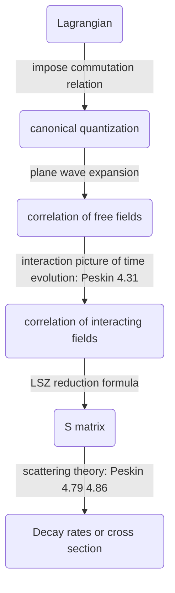

*Start writing from Mar 15, 2018*
*Only highlight points instead of the full picture*

* toc
{:toc}
# Canonical Quantization

## Free field

* Lorentz invariant of the delta function

  We choose the convention where for boson field $$[a(\vec{k_1}),a^\dagger (\vec{k_2})] = 2k^0 (2\pi)^3\delta^3(\vec{k_1}-\vec{k_2})$$ and the convention for normalization as $$\langle \vec{k}'\vert \vec{k}\rangle = 2k^0 (2\pi)^3 \delta^3(\vec{k}-\vec{k}')$$. The reason is that we can show $$k^0\delta^3$$ as a whole is Lorentz invariant.
  $$
  \begin{aligned}&  k_0\delta^3(\vec{k}) = k_0\delta^3(\vec{k'})\frac{d\vec{k'}}{d\vec{k}}=k_0\delta^3(\vec{k'})\frac{dk'_3}{dk_3}\\=&\delta^3(\vec{k'})\gamma(k_0+\beta k_0\frac{d \sqrt{\vec{k}^2+m^2}}{d k_3})= \delta^3(\vec{k'})k'\end{aligned}
  $$

* The frequently used relation in spectrum of propagators (proof using contour integral)
  $$
  \theta(\lambda)=\frac{i}{2\pi}\int_{-\infty}^{+\infty}d \omega \frac{e^{-i \omega\lambda}}{\omega +\epsilon}~,~~\epsilon>0.
  $$
  The introduction of $$\epsilon$$ is of physical meaning: equivalent to replace the mass as $$m^2\rightarrow m^2-i \epsilon$$ in $$L$$. In interacting case, $$\epsilon$$ is propotional to the width of decay.

* The propagator definition of fermion 
  $$
  \langle 0\vert T(\psi_\alpha(x)\bar{\psi}_\beta(y))\vert 0\rangle=\theta (x^0-y^0)\alpha\bar{\beta}-\theta(y^0-x^0)\bar{\beta}\alpha.
  $$
  Note the minus sign.

## Interacting field and Feynman rules

* Logic flow of interacting field theory derivation

